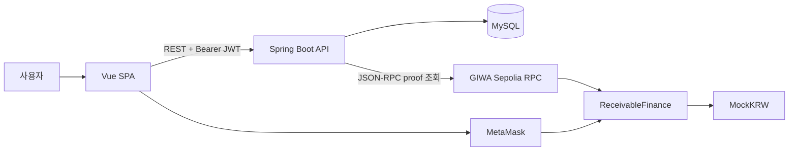
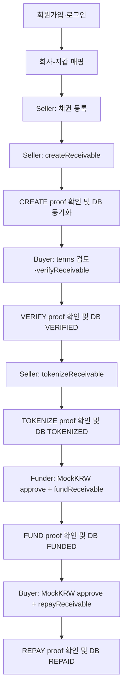
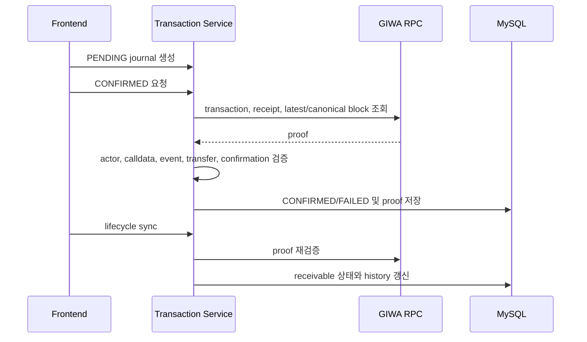

# GIWA Receivable Financing MVP

## 문서 탐색

[프로젝트 분석](./PROJECT_ANALYSIS.md) | [시스템 아키텍처](./SYSTEM_ARCHITECTURE.md) | [스마트 컨트랙트](./SMART_CONTRACT_DESIGN.md) | [백엔드](./BACKEND_DESIGN.md) | [프런트엔드](./FRONTEND_DESIGN.md) | [보안 및 기술 의사결정](./SECURITY_AND_TECHNICAL_DECISIONS.md) | [백서 초안](./WHITEPAPER_DRAFT.md)

## 1. Project Overview

- GIWA Sepolia 기반의 매출채권 금융 MVP다.
- Seller, Buyer, Funder 역할이 참여하는 단일 매출채권 lifecycle을 구현한다.
- Seller는 채권을 등록하고, Buyer 검증 후 ERC-721 NFT로 토큰화한다.
- Funder는 MockKRW로 `fundingAmount`를 Seller에게 지급하고 NFT를 수령한다.
- Buyer는 `faceValue`를 상환 시점의 NFT 소유자에게 지급한다.
- 온체인 상태와 오프체인 DB 상태는 별도로 저장하며, backend가 RPC proof를 검증한 뒤 DB 상태를 동기화한다.

| 계층       | 구현                                                       |
| ---------- | ---------------------------------------------------------- |
| Frontend   | Vue 3, Vite, Pinia, ethers.js v6, PrimeVue                 |
| Backend    | Spring Boot 4.1.0, Java 17, MyBatis, Spring Security, JJWT |
| Database   | MySQL 8 스키마, H2 통합 테스트 스키마                      |
| Blockchain | GIWA Sepolia, Solidity 0.8.24, OpenZeppelin 5.4.0          |
| 결제 토큰  | `MockKRW` ERC-20, 0 decimals                               |
| 채권 자산  | `ReceivableFinance`의 ERC-721 NFT                          |

## 2. Problem Statement

- 매출채권 lifecycle에는 Seller의 채권 등록, Buyer의 검증, 제3자 자금 공급, 상환 수취인 결정이 포함된다.
- 온체인 transaction hash만 저장하는 방식으로는 실제 호출자, calldata, event, ERC-20 지급, NFT 이전이 기대한 업무 상태와 일치하는지 확인할 수 없다.
- NFT가 펀딩 후 양도될 수 있으므로 상환 수취인은 최초 Funder가 아니라 현재 NFT 소유자여야 한다.
- 브라우저 transaction은 receipt 대기, reload, MetaMask replacement, backend 동기화 실패에 대응해야 한다.

| 처리 대상     | MVP 구현                                            |
| ------------- | --------------------------------------------------- |
| 당사자와 지갑 | 회사-지갑 매핑, Seller/Buyer/Funder 권한 검사       |
| 순차 상태     | `CREATED → VERIFIED → TOKENIZED → FUNDED → REPAID`  |
| 온체인 증거   | PENDING/CONFIRMED/FAILED 거래 저널과 RPC proof      |
| NFT 소유권    | Finance 컨트랙트 에스크로 후 Funder 이전            |
| 상환 수취인   | `ownerOf(tokenId)`의 현재 소유자                    |
| 브라우저 중단 | localStorage 기반 receipt/replacement/sync recovery |

- 실제 채권의 법적 유효성, 외부 문서 검증, 신용 위험, 현금 결제, 규제 준수는 현재 MVP에서는 구현되지 않았으며 향후 구현 예정입니다.

## 3. Proposed Solution

- frontend는 MetaMask를 통해 사용자 지갑의 signer로 모든 컨트랙트 쓰기 거래를 전송한다.
- backend는 private key를 보관하거나 컨트랙트 거래를 전송하지 않는다.
- backend는 MySQL에 사용자, 회사, 지갑, 채권, 상태 이력, 거래 저널을 저장한다.
- lifecycle DB 전이는 backend RPC verifier가 확인한 거래 proof를 요구한다.
- frontend는 온체인 성공 후 DB sync가 실패하면 새 거래를 전송하지 않고 동일 hash로 sync만 재시도한다.

## 4. Architecture

| 구성요소          | 책임                                                        | 연결                                       |
| ----------------- | ----------------------------------------------------------- | ------------------------------------------ |
| Vue SPA           | UI, API 호출, 지갑 선택, signer 요청, receipt/recovery 처리 | REST API, MetaMask, GIWA RPC read provider |
| MetaMask          | 계정 권한, network 전환, transaction 서명·전송              | Browser, GIWA Sepolia                      |
| Spring Boot API   | 인증, 지갑 매핑, 채권/저널 상태, RPC proof 검증             | SPA, MySQL, GIWA RPC                       |
| MySQL             | 관계 데이터와 상태 이력 영속화                              | Spring Boot API                            |
| ReceivableFinance | 상태 머신, ERC-721 NFT, 펀딩/상환 실행                      | MetaMask signer, MockKRW                   |
| MockKRW           | 테스트 ERC-20, allowance 기반 지급                          | MetaMask signer, ReceivableFinance         |

### 4.1 데이터 경계

- DB의 `receivables`는 업무 상태와 온체인 ID, NFT ID, contract address, lifecycle transaction hash를 저장한다.
- 컨트랙트는 Seller, Buyer, Funder, 금액, 날짜, document hash, token ID, lifecycle status를 저장한다.
- DB 상태 변경은 확인된 거래 저널을 기준으로 수행되며, client receipt 값은 authoritative 저장값으로 사용하지 않는다.
- backend는 transaction, receipt, canonical block, confirmation depth, calldata, lifecycle event, 필요한 ERC-20/ERC-721 Transfer를 RPC에서 검증한다.

### 4.2 배포 구성

- frontend는 Vite build 산출물을 Vercel에 배포하는 구성이 문서와 환경 파일에 있다.
- backend는 Java 17 Dockerfile로 빌드되며 non-root `app` 사용자로 `app.jar`를 실행한다.
- backend datasource는 `DB_*` 또는 Railway `MYSQL*` 환경변수를 지원한다.
- CORS는 `CORS_ALLOWED_ORIGINS`의 exact origin 목록으로 설정한다.
- `GET /health`는 DB와 RPC 상태를 검사하지 않는 liveness endpoint다.
- 실제 Railway/Vercel runtime 환경변수와 현재 배포 상태는 저장소만으로 새로 검증할 수 없다.

## 5. Business Flow

| 단계      | actor                    | DB 상태 결과                      | 온체인 결과                              |
| --------- | ------------------------ | --------------------------------- | ---------------------------------------- |
| 채권 등록 | Seller 회사 사용자       | CREATED                           | 없음                                     |
| 체인 생성 | Seller 등록 지갑         | CREATED 유지, chain metadata 저장 | CREATED                                  |
| 검증      | Buyer 등록 지갑          | VERIFIED                          | VERIFIED                                 |
| 토큰화    | Seller 등록 지갑         | TOKENIZED                         | Finance 컨트랙트가 NFT 에스크로 소유     |
| 펀딩      | Seller/Buyer 이외 Funder | FUNDED                            | MockKRW Funder→Seller, NFT escrow→Funder |
| 상환      | Buyer 등록 지갑          | REPAID                            | MockKRW Buyer→현재 NFT 소유자            |

- Buyer 검토 checkbox는 frontend local state이며 Web2 승인 레코드로 저장하지 않는다.
- Funder는 `fundingAmount`, Buyer는 `faceValue`만큼 Finance 컨트랙트에 allowance를 먼저 부여해야 한다.
- Approval과 fund/repay는 별도 MetaMask transaction이다.
- 부분 펀딩, 다중 Funder, 부분 상환, 연체료, 디폴트, 취소는 현재 MVP에서는 구현되지 않았으며 향후 구현 예정입니다.

## 6. Smart Contract

### 6.1 Contracts

| 컨트랙트            | 상속 및 구성                                                       | 역할                                |
| ------------------- | ------------------------------------------------------------------ | ----------------------------------- |
| `ReceivableFinance` | `ERC721`, `ReentrancyGuard`, `SafeERC20`, immutable `paymentToken` | lifecycle, NFT, 펀딩, 상환          |
| `MockKRW`           | `ERC20`, `Ownable`, `INITIAL_SUPPLY=1_000_000_000`                 | 테스트 토큰 발행 및 ERC-20 transfer |

### 6.2 Lifecycle 함수

| 함수                 | 접근·상태 조건                                       | 저장/자산 결과                                  |
| -------------------- | ---------------------------------------------------- | ----------------------------------------------- |
| `createReceivable`   | 모든 caller; Buyer nonzero/self 금지, 금액/날짜 검증 | caller를 Seller로 기록하고 CREATED 생성         |
| `verifyReceivable`   | 저장된 Buyer, CREATED                                | VERIFIED                                        |
| `tokenizeReceivable` | 저장된 Seller, VERIFIED                              | token ID 생성, Finance에 NFT mint, TOKENIZED    |
| `fundReceivable`     | Seller/Buyer 이외 caller, TOKENIZED                  | Funder 기록, MockKRW→Seller, NFT→Funder, FUNDED |
| `repayReceivable`    | 저장된 Buyer, FUNDED                                 | MockKRW→현재 NFT owner, REPAID                  |
| `getReceivable`      | 모든 caller                                          | 저장 구조체 반환                                |

- `fundReceivable`과 `repayReceivable`은 `nonReentrant`를 사용한다.
- 정산은 `paymentToken.safeTransferFrom`으로 수행되며 실패 시 EVM 트랜잭션 전체가 revert된다.
- `MockKRW.decimals()`는 0이다.
- `MockKRW.mint`는 owner만 호출할 수 있으며 발행량 cap은 없다.
- `CANCELLED`는 enum에만 존재하고 상태 전이 함수는 없다. 현재 MVP에서는 구현되지 않았으며 향후 구현 예정입니다.
- NFT metadata URI, document onchain storage, permissioned NFT transfer, NFT burn은 현재 MVP에서는 구현되지 않았으며 향후 구현 예정입니다.

## 7. Backend

### 7.1 모듈

| 패키지                             | 책임                                                |
| ---------------------------------- | --------------------------------------------------- |
| `auth`                             | 회원가입, 로그인, JWT, 현재 사용자                  |
| `company`                          | 회사 INSERT 및 사업자번호 조회                      |
| `wallet`                           | 회사-지갑 매핑                                      |
| `receivable`                       | 채권 생성/조회, lifecycle DB 동기화                 |
| `transaction`                      | 거래 저널, RPC client, proof verifier, failure 기록 |
| `config`, `common.error`, `health` | framework 설정, 공통 오류, health endpoint          |

### 7.2 인증과 데이터 접근

- 회원가입은 새 회사와 사용자를 하나의 `@Transactional` 처리로 생성한다.
- password는 BCrypt hash로 저장한다.
- JWT는 HMAC으로 서명하며 subject=email, issued-at, expiration을 기록한다.
- `/auth/signup`, `/auth/login`, `/health`를 제외한 API는 JWT 인증을 요구한다.
- MyBatis mapper는 annotation SQL을 사용하며 camel-case 매핑이 설정되어 있다.
- DB는 wallet address, transaction hash, 주요 onchain metadata에 UNIQUE 제약을 사용한다.

### 7.3 거래 저널과 RPC proof

| 거래 유형 | backend proof 검증                                                  |
| --------- | ------------------------------------------------------------------- |
| CREATE    | Seller/Buyer/금액/날짜/document hash, calldata, `ReceivableCreated` |
| VERIFY    | Buyer, onchain receivable ID, calldata, `ReceivableVerified`        |
| TOKENIZE  | Seller, onchain ID, calldata, event, ERC-721 mint Transfer          |
| FUND      | Funder, token ID, Seller, 금액, event, MockKRW/NFT Transfer         |
| REPAY     | Buyer, token ID, event recipient, MockKRW Buyer→recipient Transfer  |

- journal status는 PENDING, CONFIRMED, FAILED다.
- RPC proof 저장에는 chain/block/gas/event 요약, 검증 시각, `verification_version`이 포함된다.
- 동일 요청 재시도는 멱등적으로 처리하며, 서로 다른 metadata/hash는 conflict로 처리한다.
- 블록체인 indexer, websocket subscription, server-side receipt polling은 현재 MVP에서는 구현되지 않았으며 향후 구현 예정입니다.

## 8. Frontend

### 8.1 화면과 상태

| route          | 화면        | 주요 기능                                           |
| -------------- | ----------- | --------------------------------------------------- |
| `/login`       | Login       | 로그인/회원가입                                     |
| `/dashboard`   | Dashboard   | 지갑 계정 선택·연결, 업무 화면 이동                 |
| `/receivables` | Receivables | 채권 등록, create/verify/tokenize, recovery         |
| `/funding`     | Funding     | 기회 조회, readiness, approval, fund, sync retry    |
| `/repayment`   | Repayment   | FUNDED 채권, readiness, approval, repay, sync retry |

- Pinia stores는 `auth`, `wallet`, `receivable`이다.
- `apiRequest`는 모든 REST 호출을 수행하고 Bearer token과 공통 `ApiError`를 처리한다.
- MetaMask provider는 GIWA chain ID를 검사·전환하고 DB에 등록된 기대 wallet address의 signer를 요청한다.
- auth token과 transaction recovery payload는 browser localStorage에 저장한다.

### 8.2 Recovery 처리

- MetaMask가 hash를 반환하면 frontend는 localStorage recovery payload를 저장하고 backend PENDING journal을 생성한다.
- receipt 확인 후 frontend는 receipt event를 검사하고 backend CONFIRMED 요청을 수행한다.
- backend sync가 실패하면 hash를 유지한 채 backend-only sync를 재시도한다.
- tokenization 전에는 server journal을 조회해 CONFIRMED/PENDING TOKENIZE 후보가 있으면 새 mint를 막는다.
- replacement transaction은 replacement hash를 저널에 기록하고 원 hash를 `TRANSACTION_REPLACED`로 FAILED 처리한다.
- 다른 기기/브라우저 간 transaction recovery 동기화와 atomic intent lease는 현재 MVP에서는 구현되지 않았으며 향후 구현 예정입니다.

## 9. Security

| 영역           | 구현 통제                                                                      |
| -------------- | ------------------------------------------------------------------------------ |
| Smart contract | 역할 검사, exact state 검사, custom errors, `nonReentrant`, `SafeERC20`        |
| NFT            | Finance 에스크로, `_safeTransfer` receiver 검사, current owner repayment       |
| API 인증       | BCrypt, HMAC JWT, stateless Spring Security, 401/403 분리                      |
| 업무 권한      | 회사-지갑 mapping, Seller/Buyer/Funder 비교, transaction submitter ownership   |
| Database       | FK, UNIQUE, CHECK, 조건부 lifecycle UPDATE, status history                     |
| RPC            | chain/signer/target/value/calldata/receipt/canonical block/event/transfer 검증 |
| 오류 응답      | stable code와 user-safe message, 내부 예외 상세 비노출                         |

- wallet connect API는 backend message signature challenge로 wallet control을 증명하지 않는다. 현재 MVP에서는 구현되지 않았으며 향후 구현 예정입니다.
- JWT는 localStorage에 저장되며 refresh token, revocation, MFA가 없다. 현재 MVP에서는 구현되지 않았으며 향후 구현 예정입니다.
- CSP, rate limiting, WAF, SIEM, central audit logging, secret manager integration은 현재 MVP에서는 구현되지 않았으며 향후 구현 예정입니다.
- Finance 컨트랙트는 NFT의 펀딩 후 양도를 제한하지 않는다.

## 10. Technical Decisions

| 결정                         | 문서에 기록된 이유                        | 구현                                                         |
| ---------------------------- | ----------------------------------------- | ------------------------------------------------------------ |
| MetaMask write transaction   | private key를 저장하지 않음               | 모든 contract write에 등록 기대 signer 사용                  |
| Company-wallet mapping       | Web2 인증 유지, blockchain ownership 검증 | `company_wallets`, 인증 사용자 company ID, wallet uniqueness |
| Finance NFT escrow           | Seller approval 거래 제거                 | tokenization 시 Finance에 mint                               |
| Single Funder                | MVP 단순화                                | 채권당 단일 `funder` address와 단일 funding 전이             |
| Backend transaction metadata | blockchain을 source of truth로 유지       | backend는 proof/journal을 저장하고 거래에 서명하지 않음      |
| MockKRW 0 decimals           | DB/UI/contract 간 단위 scaling 오류 방지  | `DECIMAL(36,0)`, `decimals()=0`                              |

| 기술         | 저장소에서 확인되는 구성                                         |
| ------------ | ---------------------------------------------------------------- |
| GIWA Sepolia | chain ID 91342, Hardhat deploy/verify, frontend/backend RPC 설정 |
| Spring Boot  | Java 17 REST API, Spring Security, MyBatis                       |
| Vue/Vite     | Vue 3 SPA, Pinia, ethers.js                                      |
| MySQL        | 관계 데이터, FK/UNIQUE/CHECK, 거래 저널                          |
| Railway      | Java 17 Docker runtime과 `MYSQL*` 환경변수 지원                  |
| Vercel       | Vite SPA build와 `VITE_API_URL` 구성                             |

- GIWA, Spring Boot, Vue, MySQL, Railway, Vercel을 다른 대안과 비교해 선택한 상세 사유는 저장소에 기록되어 있지 않다.

## 11. MVP Scope

### 11.1 구현 범위

- 이메일/비밀번호 계정과 회사 생성
- 회사-지갑 매핑
- 채권 생성·목록·상세·funding opportunity 조회
- Buyer verify, ERC-721 tokenization, 단일 Funder funding, Buyer repayment
- 거래 저널, RPC proof 검증, frontend recovery
- Hardhat lifecycle/rollback 테스트와 Spring H2 통합 테스트

### 11.2 제외 범위

- 실결제, KYC/AML, 신용평가, liquidity pool은 현재 MVP에서는 구현되지 않았으며 향후 구현 예정입니다.
- document upload/storage, oracle document validation, document duplicate prevention은 현재 MVP에서는 구현되지 않았으며 향후 구현 예정입니다.
- 채권 수정·삭제 API, 관리자 기능, 회사 관리 API, 검색/pagination API는 현재 MVP에서는 구현되지 않았으며 향후 구현 예정입니다.
- permissioned NFT transfer, upgradeable contract, production 금융 운영 통제는 현재 MVP에서는 구현되지 않았으며 향후 구현 예정입니다.

## 12. Roadmap

| 항목                                                               | 현재 상태                                              |
| ------------------------------------------------------------------ | ------------------------------------------------------ |
| 기존/신규 MySQL schema와 journal migration 적용                    | 현재 MVP에서는 구현되지 않았으며 향후 구현 예정입니다. |
| Railway MySQL reference, JWT secret, Vercel CORS origin 설정       | 현재 MVP에서는 구현되지 않았으며 향후 구현 예정입니다. |
| Railway/Vercel runtime contract address 갱신과 신규 lifecycle 실행 | 현재 MVP에서는 구현되지 않았으며 향후 구현 예정입니다. |
| current NFT owner의 `faceValue` 수령 확인                          | 현재 MVP에서는 구현되지 않았으며 향후 구현 예정입니다. |
| server-side intent lease                                           | 현재 MVP에서는 구현되지 않았으며 향후 구현 예정입니다. |
| blockchain indexer/reconciliation worker                           | 현재 MVP에서는 구현되지 않았으며 향후 구현 예정입니다. |
| Hardhat 2/solc development dependency advisory 해소                | 현재 MVP에서는 구현되지 않았으며 향후 구현 예정입니다. |

## 13. Expected Impact

- 구현은 Seller, Buyer, Funder가 참여하는 한 채권 lifecycle을 local test와 backend 통합 테스트에서 검증하는 범위를 제공한다.
- backend는 DB lifecycle write 전에 온체인 asset 이동과 lifecycle event를 RPC proof로 확인한다.
- 상환 수취인을 current NFT owner로 계산해 NFT 양도 이후의 수취인 변경을 반영한다.
- browser reload, replacement, backend sync 실패를 transaction 재전송과 분리해 처리한다.
- 이 MVP는 실제 금융상품의 적법성, 신용위험, 자금보관, 규제준수, 운영 통제를 보장하지 않는다.
- production 금융 서비스에 필요한 KYC/AML, 실결제, 분쟁 처리, 보안 운영 통제는 현재 MVP에서는 구현되지 않았으며 향후 구현 예정입니다.
