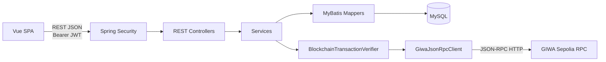
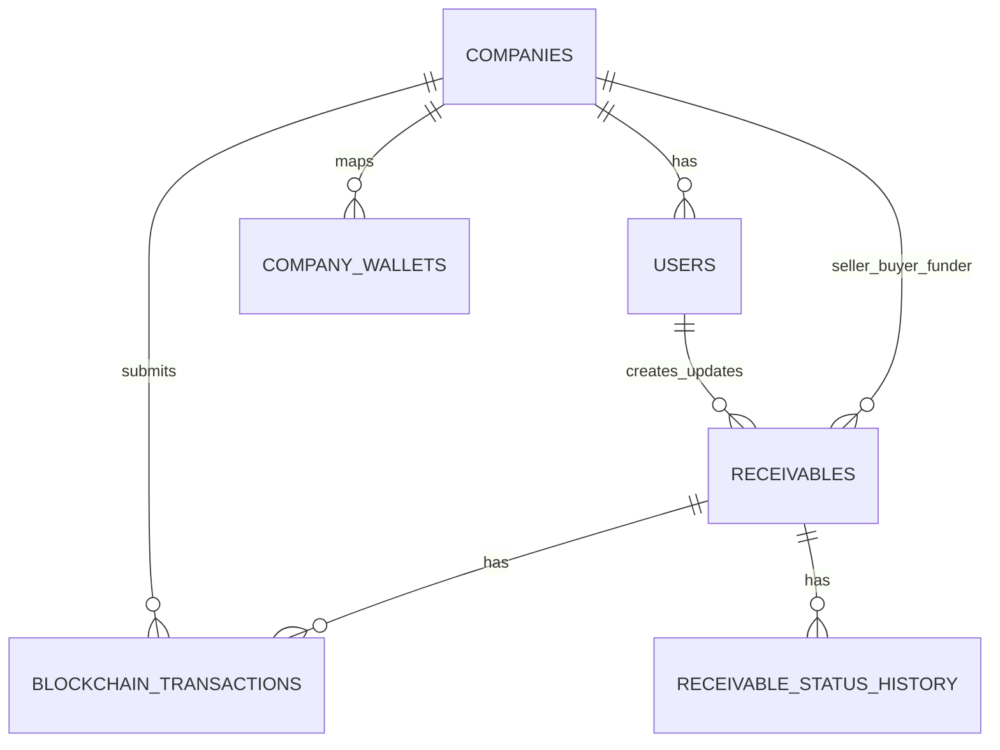
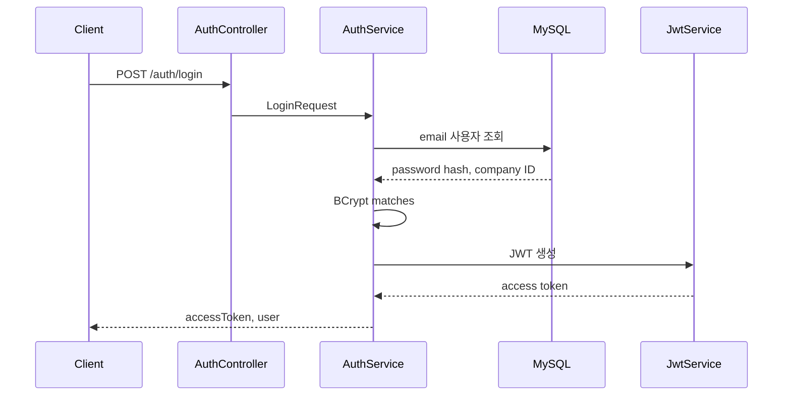
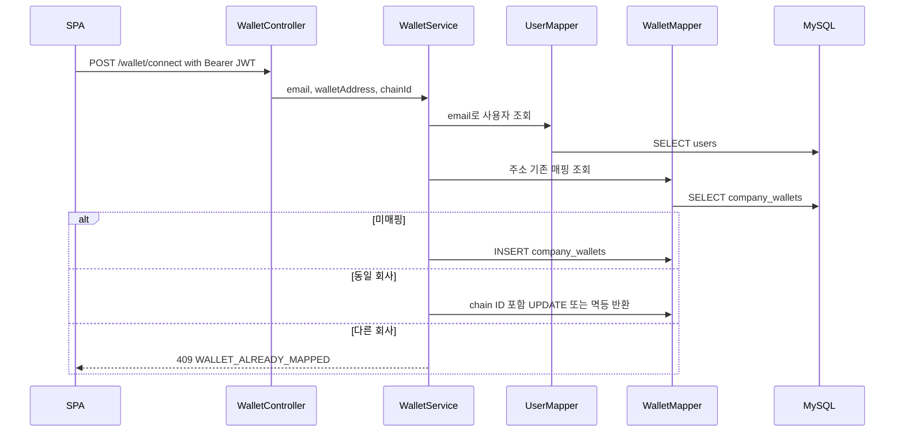
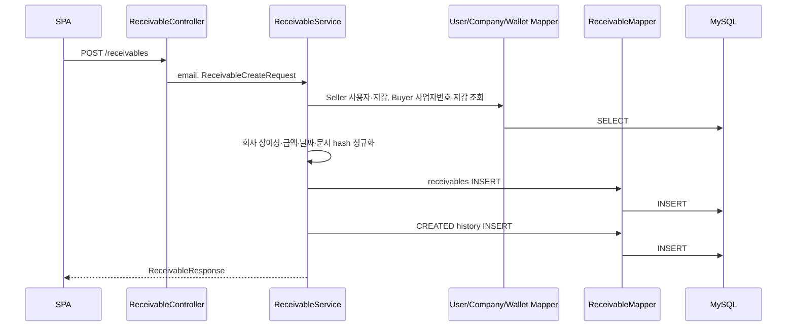
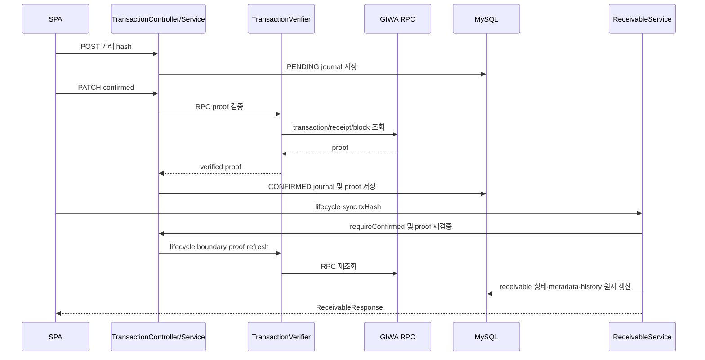

# 백엔드 설계

## 문서 탐색

[최종 백서](./WHITEPAPER.md) | [프로젝트 분석](./PROJECT_ANALYSIS.md) | [시스템 아키텍처](./SYSTEM_ARCHITECTURE.md) | [스마트 컨트랙트](./SMART_CONTRACT_DESIGN.md) | [프런트엔드](./FRONTEND_DESIGN.md) | [보안 및 기술 의사결정](./SECURITY_AND_TECHNICAL_DECISIONS.md) | [백서 초안](./WHITEPAPER_DRAFT.md)

## 1. 범위와 기술 구성

- 대상 모듈은 `giwa-api`이다.
- 런타임은 Java 17과 Spring Boot `4.1.0`이다.
- HTTP 계층은 Spring Web MVC, 인증·인가 계층은 Spring Security, 입력 검증은 Jakarta Bean Validation을 사용한다.
- 영속성 계층은 MyBatis `3.0.5`와 MySQL Connector/J를 사용한다.
- 테스트 런타임은 H2이며 `src/test/resources/schema.sql`을 사용한다.
- JWT 구현은 JJWT `0.12.6`, 비밀번호 해싱은 BCrypt다.
- GIWA JSON-RPC 통신은 Java `HttpClient`와 Jackson `ObjectMapper`로 구현한다.
- 백엔드는 블록체인 개인키를 저장하거나 MetaMask를 대신하여 거래를 서명·전송하지 않는다.

## 2. Spring Boot 아키텍처

### 2.1 계층 구성

| 계층 | 구현 | 책임 |
| --- | --- | --- |
| Application | `GiwaApiApplication` | Spring Boot bootstrap |
| Web | `*Controller` | 요청 매핑, request validation, 인증 principal 전달 |
| Service | `AuthService`, `WalletService`, `ReceivableService`, `BlockchainTransactionService` | 업무 규칙, 권한, 상태 전이, 트랜잭션 경계 |
| Persistence | `*Mapper` | annotation SQL과 객체 매핑 |
| Blockchain client | `GiwaJsonRpcClient`, `BlockchainTransactionVerifier` | JSON-RPC proof 조회 및 lifecycle 거래 검증 |
| Security | `SecurityConfig`, `JwtService`, `SecurityErrorHandler` | JWT 인증, CORS, 401/403 응답 |
| Error | `ApiException`, `ApiError`, `GlobalExceptionHandler` | 공통 오류 모델과 예외 변환 |

- 컨트롤러는 `@AuthenticationPrincipal String email`을 받아 서비스에 전달한다.
- 서비스는 email에서 사용자와 회사 ID를 조회하고 실제 역할을 판단한다.
- Mapper는 DB row를 domain/response 객체로 매핑한다.
- 블록체인 lifecycle 상태 동기화는 서비스가 거래 저널의 검증된 증거를 요구한 뒤 DB를 갱신한다.
- 비동기 메시지 큐, 이벤트 버스, scheduler, background worker는 없다. 현재 MVP에서는 구현되지 않았으며 향후 구현 예정입니다.

### 2.2 설정과 Bean

| 구성 | 구현 |
| --- | --- |
| `SecurityFilterChain` | stateless session, CSRF disable, CORS enable, JWT filter 등록 |
| `PasswordEncoder` | `BCryptPasswordEncoder` |
| `CorsConfigurationSource` | comma-separated exact allowed origins, GET/POST/PATCH/OPTIONS, Authorization/Content-Type headers |
| `SqlSessionFactory` | 명시적 `SqlSessionFactoryBean` 생성 |
| `SqlSessionTemplate` | MyBatis Spring template 생성 |
| `BlockchainRpcProperties` | `app.blockchain.*` 환경 설정 바인딩 |
| `GiwaJsonRpcClient` | Java `HttpClient` 기반 JSON-RPC client |

| 설정 키 | 기본값 또는 해석 |
| --- | --- |
| `server.address` | `0.0.0.0` |
| `server.port` | `PORT`, 없으면 `SERVER_PORT`, 없으면 8080 |
| `spring.datasource.*` | `DB_*` 또는 Railway `MYSQL*`, 기본 local MySQL |
| `spring.sql.init.mode` | `never` |
| `jwt.secret` | `JWT_SECRET`, 없으면 local fallback |
| `jwt.expiration-ms` | `JWT_EXPIRATION_MS`, 기본 86,400,000 ms |
| `app.cors.allowed-origins` | `CORS_ALLOWED_ORIGINS`, 기본 `http://localhost:5173` |
| `app.blockchain.*` | RPC URL, chain ID, Finance/MockKRW 주소, timeout, confirmation depth |

- `spring.sql.init.mode=never`이므로 백엔드 기동 시 MySQL schema를 생성하거나 migration을 자동 실행하지 않는다.
- 운영 환경의 `JWT_SECRET`, datasource, CORS origin, 계약 주소는 환경변수로 제공해야 한다.
- configuration server, secret manager, profile 별 운영 설정 파일, migration runner는 현재 MVP에서는 구현되지 않았으며 향후 구현 예정입니다.

## 3. Package Structure

| 패키지 | 클래스 | 역할 |
| --- | --- | --- |
| `com.leonid.giwaapi` | `GiwaApiApplication` | 애플리케이션 시작점 |
| `auth` | Controller, Service, JWT service, request/response, User, UserMapper | 계정·인증 |
| `company` | `Company`, `CompanyMapper` | 회사 생성 및 조회 |
| `wallet` | Controller, Service, request/response, Wallet, WalletMapper | 회사-지갑 매핑 |
| `receivable` | Controller, Service, request/response, Receivable, ReceivableMapper | 매출채권과 DB lifecycle 동기화 |
| `transaction` | Controller, Service, Mapper, verifier, RPC client/proof, request/response | 온체인 거래 저널 및 RPC 검증 |
| `config` | MyBatis/Security/error 설정 | framework configuration |
| `common.error` | error record, exception, advice | 표준 오류 응답 |
| `health` | `HealthController` | 공개 health endpoint |

- `document` 패키지와 파일 저장 구현은 `src/main/java`에 없다. 현재 MVP에서는 구현되지 않았으며 향후 구현 예정입니다.
- 회사 관리 controller/service, 관리자 패키지, 배치/worker 패키지는 없다. 현재 MVP에서는 구현되지 않았으며 향후 구현 예정입니다.

## 4. Controllers와 REST API

### 4.1 Endpoint 목록

| Controller | HTTP | 경로 | 인증 | Service |
| --- | --- | --- | --- | --- |
| `AuthController` | POST | `/auth/signup` | 불필요 | `AuthService.signup` |
| `AuthController` | POST | `/auth/login` | 불필요 | `AuthService.login` |
| `AuthController` | GET | `/auth/me` | 필요 | `AuthService.me` |
| `HealthController` | GET | `/health` | 불필요 | 없음 |
| `WalletController` | POST | `/wallet/connect` | 필요 | `WalletService.connect` |
| `WalletController` | GET | `/wallet/me` | 필요 | `WalletService.me` |
| `ReceivableController` | POST | `/receivables` | 필요 | `ReceivableService.create` |
| `ReceivableController` | GET | `/receivables` | 필요 | `ReceivableService.getAll` |
| `ReceivableController` | GET | `/receivables/funding-opportunities` | 필요 | `ReceivableService.getFundingOpportunities` |
| `ReceivableController` | GET | `/receivables/{receivableId}` | 필요 | `ReceivableService.getById` |
| `ReceivableController` | POST | `/receivables/{id}/chain-created` | 필요 | `ReceivableService.markChainCreated` |
| `ReceivableController` | POST | `/receivables/{id}/verified` | 필요 | `ReceivableService.markVerified` |
| `ReceivableController` | POST | `/receivables/{id}/tokenized` | 필요 | `ReceivableService.markTokenized` |
| `ReceivableController` | POST | `/receivables/{id}/funded` | 필요 | `ReceivableService.markFunded` |
| `ReceivableController` | POST | `/receivables/{id}/repaid` | 필요 | `ReceivableService.markRepaid` |
| `BlockchainTransactionController` | POST | `/blockchain-transactions` | 필요 | `BlockchainTransactionService.create` |
| `BlockchainTransactionController` | PATCH | `/blockchain-transactions/{txHash}/confirmed` | 필요 | `BlockchainTransactionService.markConfirmed` |
| `BlockchainTransactionController` | PATCH | `/blockchain-transactions/{txHash}/failed` | 필요 | `BlockchainTransactionService.markFailed` |
| `BlockchainTransactionController` | GET | `/receivables/{id}/transactions` | 필요 | `BlockchainTransactionService.getAllByReceivable` |

- `POST /receivables`와 `POST /blockchain-transactions`는 `201 Created`를 반환하도록 지정되어 있다.
- `/health`는 `{"status":"UP"}`만 반환한다. datasource 또는 RPC 상태를 조회하지 않는다.
- 매출채권 수정·삭제, 문서 업로드/다운로드, 회사 관리, 관리자 API, 검색·페이지네이션 API는 현재 MVP에서는 구현되지 않았으며 향후 구현 예정입니다.

### 4.2 Request Validation

| 요청 | 주요 검증 |
| --- | --- |
| `SignupRequest` | email, 8~72자 password, 사용자/회사명, 숫자 10자리 사업자번호 |
| `LoginRequest` | email, 8~72자 password |
| `WalletConnectRequest` | Ethereum address와 chain ID 형식 |
| `ReceivableCreateRequest` | Buyer 사업자번호, 양수 정수 금액, 날짜, 선택 bytes32 형식 문서 hash, 설명 길이 |
| lifecycle sync request | hash와 chain metadata의 형식 |
| 거래 journal request | 유형, hash, 계약 주소, decimal string receipt 값, 실패 코드/메시지 |

- Bean validation 오류는 `400 VALIDATION_FAILED`와 field별 오류를 반환한다.
- 서비스는 Bean validation 이후에도 주소/hash 정규화, 역할, DB 상태, 저널 상태를 검사한다.

## 5. Services

### 5.1 `AuthService`

| 메서드 | 처리 |
| --- | --- |
| `signup` | email 중복 확인, 회사 INSERT, BCrypt password hash 생성, 사용자 INSERT, JWT와 사용자 응답 반환 |
| `login` | email로 사용자 조회, BCrypt matches 확인, JWT와 사용자 응답 반환 |
| `me` | email로 사용자 조회 후 `UserResponse` 반환 |

- `signup`은 `@Transactional`이다. 회사 또는 사용자 INSERT가 실패하면 전체 트랜잭션이 rollback된다.
- 가입 시 회사는 새로 생성된다. 기존 회사에 사용자를 추가하는 API는 없다. 현재 MVP에서는 구현되지 않았으며 향후 구현 예정입니다.
- 로그인 실패는 `ResponseStatusException(401)`으로 시작하며 global handler가 공통 오류 JSON으로 변환한다.

### 5.2 `WalletService`

| 메서드 | 처리 |
| --- | --- |
| `connect` | 인증 email의 사용자 조회, 주소 소문자 정규화, 주소의 기존 매핑 확인, 동일 회사 멱등/chain ID 갱신 또는 신규 INSERT |
| `me` | 인증 사용자의 회사 primary wallet 조회 |

- wallet address는 `company_wallets.wallet_address`의 전역 UNIQUE 제약과 서비스 검사를 함께 사용한다.
- 같은 주소가 다른 회사에 매핑된 경우 `409 WALLET_ALREADY_MAPPED`를 반환하며 소유 회사 식별자를 노출하지 않는다.
- DB unique race로 발생하는 `DataIntegrityViolationException`도 wallet conflict 경로로 처리한다.
- 지갑 메시지 서명 기반 소유 증명, 다중 지갑 관리, 지갑 연결 해제 API는 현재 MVP에서는 구현되지 않았으며 향후 구현 예정입니다.

### 5.3 `ReceivableService`

| 메서드 | 처리 |
| --- | --- |
| `create` | Seller 사용자/회사와 primary wallet 조회, Buyer 사업자번호의 회사·wallet 조회, 입력 정규화, 채권 INSERT, CREATED 상태 이력 INSERT |
| `getAll` | Seller, Buyer 또는 배정 Funder인 채권 목록 조회 |
| `getFundingOpportunities` | 현재 회사가 Seller/Buyer가 아니고 Funder가 비어 있는 TOKENIZED 채권 조회 |
| `getById` | 역할 또는 funding candidate 가시성 규칙을 검사한 상세 조회 |
| `markChainCreated` | Seller와 CREATED 상태 확인, CREATE 저널 proof 요구, 온체인 ID·계약·create hash 저장 |
| `markVerified` | Buyer와 CREATED 상태 확인, VERIFY 저널 proof 요구, VERIFIED 및 상태 이력 저장 |
| `markTokenized` | Seller와 VERIFIED 상태 확인, TOKENIZE 저널의 RPC event token ID 사용, TOKENIZED 및 상태 이력 저장 |
| `markFunded` | 제3자 Funder와 TOKENIZED 상태 확인, FUND 저널 proof와 설정 MockKRW 주소 사용, FUNDED 및 상태 이력 저장 |
| `markRepaid` | Buyer와 FUNDED 상태 확인, REPAY 저널 proof 요구, REPAID 및 상태 이력 저장 |

- lifecycle 동기화 요청은 새 상태를 직접 받지 않는다.
- `chain-created` 요청은 온체인 ID, tx hash, contract address를 받고, 나머지 lifecycle 요청은 tx hash 중심으로 처리한다.
- token ID는 client request가 아닌 검증된 TOKENIZE 저널의 `eventTokenId`에서 가져온다.
- Funder 회사·wallet과 MockKRW 주소는 client가 보내지 않고 인증 사용자, DB, 서버 설정 및 검증 proof에서 유도한다.
- Repayment 수취인은 DB의 original Funder 주소가 아니라 검증된 onchain event 및 MockKRW Transfer 수취인이다.
- service와 mapper가 동일 status/metadata 조건을 적용하여 동시 요청의 잘못된 상태 갱신을 방지한다.

### 5.4 `BlockchainTransactionService`

| 메서드 | 처리 |
| --- | --- |
| `create` | tx type parse, hash/contract 정규화, 인증 사용자·채권·필수 역할·등록 wallet·계약 주소·DB 상태 확인, PENDING 저널 INSERT 또는 동일 요청 멱등 반환 |
| `markConfirmed` | 제출 회사 확인, PENDING 상태 확인, RPC verifier 호출, RPC-derived proof로 CONFIRMED 저장 |
| `markFailed` | 제출 회사 확인, definitive failed/replaced 정보로 FAILED 처리 |
| `getAllByReceivable` | Seller/Buyer/배정 Funder 전체 조회 또는 미배정 funding candidate 자신의 FUND 행만 조회 |
| `requireConfirmed` | lifecycle 동기화 전에 저널 소유자·유형·hash·컨트랙트·event ID를 확인하고 RPC proof를 재검증 |

- 지원 유형은 `CREATE_RECEIVABLE`, `VERIFY_RECEIVABLE`, `TOKENIZE_RECEIVABLE`, `FUND_RECEIVABLE`, `REPAY_RECEIVABLE`이다.
- PENDING 행의 chain ID는 회사-지갑 매핑 snapshot이며, CONFIRMED 저장 시 RPC가 반환한 chain ID로 대체한다.
- hash와 주소는 소문자로 정규화한다.
- receipt의 block number, gas used, effective gas price는 JavaScript 정밀도 손실을 피하기 위해 request/response에서 decimal string으로 다루며, 확정 저장 값은 RPC proof에서 가져온다.
- `BlockchainTransactionFailureRecorder`는 deterministic terminal verification failure를 FAILED로 기록하는 보조 구성요소다.

### 5.5 `BlockchainTransactionVerifier` 및 RPC Client

| 구성요소 | 처리 |
| --- | --- |
| `GiwaJsonRpcClient` | `eth_chainId`, `eth_getTransactionByHash`, `eth_getTransactionReceipt`, `eth_blockNumber`, `eth_getBlockByNumber` 호출 |
| `GiwaRpcProof` | transaction, receipt, log, canonical block의 transport 모델 |
| `BlockchainTransactionVerifier` | transaction type별 calldata, actor, receipt, event, canonical block, confirmation depth 검증 |
| `VerifiedBlockchainTransaction` | 검증된 chain/block/gas/event ID와 verification time 전달 |
| `BlockchainVerificationException` | retryable/terminal 구분을 포함한 API 오류 변환 |

- CREATE 검증은 Seller, Buyer, face value, funding amount, issue/maturity date, document hash와 `ReceivableCreated`를 DB 값에 결합한다.
- VERIFY 검증은 Buyer, 저장된 onchain receivable ID, `verifyReceivable` calldata와 `ReceivableVerified`를 결합한다.
- TOKENIZE 검증은 Seller, 저장된 onchain ID, `ReceivableTokenized`, mint ERC-721 `Transfer`를 결합한다.
- FUND 검증은 Funder, token ID, Seller, funding amount, `ReceivableFunded`, MockKRW Funder→Seller `Transfer`, Finance escrow→Funder ERC-721 `Transfer`를 결합한다.
- REPAY 검증은 Buyer, token ID, `ReceivableRepaid`, MockKRW Buyer→event recipient `Transfer`를 결합한다.
- RPC가 없거나, receipt가 없거나, 확정 수가 부족하거나, canonical block이 일치하지 않는 경우는 retryable로 남길 수 있다. 확인된 revert 또는 deterministic calldata/event mismatch는 terminal FAILED 처리 대상이다.
- 블록체인 indexer, websocket subscription, 서버 주도 receipt polling은 현재 MVP에서는 구현되지 않았으며 향후 구현 예정입니다.

## 6. MyBatis와 Mapper 설계

### 6.1 MyBatis 구성

- `MyBatisConfig`이 `DataSource`로 `SqlSessionFactoryBean`과 `SqlSessionTemplate`을 생성한다.
- underscore-to-camel-case 매핑이 활성화되어 있다.
- Mapper 인터페이스는 `@Mapper`와 `@Select`, `@Insert`, `@Update` annotation SQL을 사용한다.
- `application.yml`에는 `classpath:/mapper/**/*.xml` 경로가 설정되어 있으나 저장소에는 XML mapper 파일이 없다.
- `MyBatisConfig`과 `application.yml` 모두 camel-case mapping을 설정한다.

### 6.2 Mapper 목록

| Mapper | 대상 테이블 | 주요 역할 |
| --- | --- | --- |
| `CompanyMapper` | `companies` | 회사 INSERT, 사업자번호 조회 |
| `UserMapper` | `users` | 사용자 INSERT, email 조회 |
| `WalletMapper` | `company_wallets` | 회사 primary wallet 조회, 주소 조회, INSERT, 갱신 |
| `ReceivableMapper` | `receivables`, `companies`, `receivable_status_history` | 채권 INSERT/목록/상세, lifecycle 조건부 UPDATE, 상태 이력 INSERT |
| `BlockchainTransactionMapper` | `blockchain_transactions`, `receivables` | 저널 INSERT/조회, proof 기반 CONFIRMED/FAILED CAS UPDATE, lifecycle hash 사용 여부 검사 |

### 6.3 조건부 갱신과 멱등성

- `ReceivableMapper` lifecycle UPDATE는 해당 actor 회사 ID, 현재 status, 선행 hash/metadata, 대상 metadata NULL 여부를 `WHERE` 조건으로 사용한다.
- `BlockchainTransactionMapper`은 `verification_version`을 조건으로 사용해 이전 검증 결과가 새 결과를 덮어쓰지 않게 한다.
- lifecycle 단계 hash가 이미 채권에 반영된 경우, 저널 실패 갱신이 확인된 상태를 downgrade하지 못하도록 검사한다.
- 동일 metadata/hash 재요청은 현재 row를 반환하는 멱등 흐름이 있고, 다른 metadata/hash 재사용은 conflict로 처리한다.
- 분산 lock, outbox pattern, database migration history table은 현재 MVP에서는 구현되지 않았으며 향후 구현 예정입니다.

## 7. 데이터베이스 구조

### 7.1 주요 테이블

| 테이블 | 백엔드 사용 |
| --- | --- |
| `companies` | 회원가입 회사 생성, Buyer 사업자번호 해석 |
| `users` | 인증 계정과 회사 소속 |
| `company_wallets` | 등록 지갑, chain ID, wallet uniqueness |
| `receivables` | 오프체인 채권 업무 상태와 온체인 메타데이터 |
| `blockchain_transactions` | PENDING/CONFIRMED/FAILED 거래 저널과 RPC proof |
| `receivable_status_history` | CREATED 이후 포함 상태 변화 이력 |
| `receivable_documents` | schema에는 존재하지만 backend가 사용하지 않음 |

### 7.2 채권과 저널의 연결

- `company_wallets.wallet_address`와 `blockchain_transactions.tx_hash`는 전역 UNIQUE다.
- `receivables`에는 `(contract_address, onchain_receivable_id)`, `create_tx_hash`, `verify_tx_hash` UNIQUE 제약이 있다.
- 금액은 `DECIMAL(36,0)`이고 DB/UI/MockKRW의 0 decimal 정수 KRW 단위에 맞춘다.
- onchain receivable ID와 token ID는 `BIGINT UNSIGNED` 및 Java `Long`으로 매핑한다.
- 파일 메타데이터 테이블과 실제 파일 저장소의 연결은 없다. 현재 MVP에서는 구현되지 않았으며 향후 구현 예정입니다.

## 8. 인증과 권한 처리

### 8.1 JWT 처리

- `JwtService`는 HMAC secret key로 JWT를 생성·파싱한다.
- JWT subject는 email이며, 현재 구현은 issued-at과 expiration을 함께 기록한다.
- security filter는 JWT에서 email만 추출하여 principal로 저장한다. 서비스는 DB를 다시 조회한다.
- 무효 토큰은 filter에서 security context를 비운 뒤 보호 경로의 authentication entry point가 처리한다.
- refresh token, token revocation list, login failure throttling, MFA는 현재 MVP에서는 구현되지 않았으며 향후 구현 예정입니다.

### 8.2 Security Filter Chain

| 구분 | 처리 |
| --- | --- |
| 공개 | `/auth/signup`, `/auth/login`, `/health`, `/error`, ERROR dispatcher |
| 보호 | 그 외 전체 경로 |
| session | `SessionCreationPolicy.STATELESS` |
| CSRF | disabled |
| JWT filter 위치 | `UsernamePasswordAuthenticationFilter` 이전 |
| 인증 실패 | `401 AUTHENTICATION_REQUIRED` |
| 접근 거부 | `403 ACCESS_DENIED` |

- 역할 기반 Spring Security authority는 생성하지 않는다.
- Seller/Buyer/Funder 권한은 서비스에서 채권의 회사 ID와 인증 사용자의 회사 ID를 비교해 판단한다.

## 9. Wallet Mapping Flow

- 주소는 소문자로 정규화한 뒤 저장·비교한다.
- primary wallet 조회는 `is_primary = 1` 조건을 사용한다.
- wallet 매핑 저장은 사용자 요청을 신뢰하며, 백엔드가 MetaMask 서명 challenge로 address control을 검증하지 않는다. 현재 MVP에서는 구현되지 않았으며 향후 구현 예정입니다.

## 10. 매출채권 및 거래 흐름

### 10.1 채권 생성

- Seller와 Buyer의 회사 ID 및 wallet address는 client input이 아니라 서버 조회 결과로 구성한다.
- `faceValue`, `fundingAmount`, 발행일, 만기일은 request validation과 service 규칙을 통과해야 한다.
- 생성 직후 DB status는 `CREATED`다.

### 10.2 거래 저널 확인과 lifecycle 동기화

| 온체인 유형 | 저널 생성 역할/DB 상태 | lifecycle sync 역할/결과 |
| --- | --- | --- |
| CREATE | Seller, `CREATED` | Seller가 chain ID·계약·create hash 저장, status 유지 |
| VERIFY | Buyer, `CREATED`와 create metadata | Buyer가 `VERIFIED` 전이 |
| TOKENIZE | Seller, `VERIFIED`와 verify metadata | Seller가 RPC event token ID로 `TOKENIZED` 전이 |
| FUND | Seller/Buyer가 아닌 Funder, `TOKENIZED`와 token metadata | Funder 정보/MockKRW 주소/funding hash 저장 후 `FUNDED` 전이 |
| REPAY | Buyer, `FUNDED`와 funding metadata | repay hash 저장 후 `REPAID` 전이 |

- lifecycle sync는 CONFIRMED 상태, 해당 회사/지갑/type/계약/hash/event ID가 일치하는 저널만 수용한다.
- legacy CONFIRMED 저널에 `rpc_verified_at`이 없으면 lifecycle write 전에 RPC backfill 검증을 수행한다.
- 이미 검증된 proof도 최초 lifecycle DB write 직전에 다시 검증하며 canonical 위치가 바뀌면 proof를 갱신한다.
- 인덱서가 없으므로 온체인 상태 변경을 서버가 독립적으로 발견해 DB에 반영하지 않는다. 현재 MVP에서는 구현되지 않았으며 향후 구현 예정입니다.

## 11. 오류 처리

### 11.1 응답 모델

| 필드 | 설명 |
| --- | --- |
| `status` | HTTP status code |
| `code` | 안정적인 machine-readable 오류 코드 |
| `message` | 사용자에게 노출 가능한 메시지 |
| `path` | 요청 URI |
| `timestamp` | 오류 생성 시간 |
| `fieldErrors` | validation field별 오류 map |

### 11.2 예외 변환

| 원인 | HTTP/code |
| --- | --- |
| `ApiException` | 예외에 지정한 status/code |
| `ResponseStatusException` | 지정 status, HTTP status name 또는 `REQUEST_FAILED` |
| `MethodArgumentNotValidException` | `400 VALIDATION_FAILED` |
| `HttpMessageNotReadableException` | `400 INVALID_REQUEST_BODY` |
| `DataIntegrityViolationException` | `409 DATA_CONFLICT` |
| 처리되지 않은 `Exception` | `500 INTERNAL_SERVER_ERROR` |
| Security authentication entry point | `401 AUTHENTICATION_REQUIRED` |
| Security access denied handler | `403 ACCESS_DENIED` |

- 업무 분기용 오류는 `ApiException`으로 구현한다.
- wallet 중복, lifecycle 권한/상태, 거래 저널 충돌, RPC 상태는 해당 서비스가 안정적인 `code`를 부여한다.
- 예상치 못한 예외의 내부 상세는 HTTP 응답으로 노출하지 않고 server log에 기록한다.
- distributed tracing, structured audit log pipeline, external error monitoring integration은 현재 MVP에서는 구현되지 않았으며 향후 구현 예정입니다.

## 12. 테스트와 미구현 범위

| 테스트 클래스 | 검증 범위 |
| --- | --- |
| `BusinessNumberValidationTests` | 사업자번호 validation |
| `CorsConfigurationIntegrationTests` | CORS origin/method 처리 |
| `HealthControllerIntegrationTests` | 공개 health endpoint |
| `WalletServiceIntegrationTests`, `WalletErrorResponseIntegrationTests` | 지갑 매핑, 중복 오류, 401/403 응답 |
| `ReceivableServiceIntegrationTests`, `ReceivableOnchainServiceIntegrationTests` | 채권 생성/권한/상태/멱등성/lifecycle 동기화 |
| `BlockchainTransactionServiceIntegrationTests` | 저널, RPC proof 저장, 권한·상태·CAS·가시성 |
| `BlockchainTransactionVerifierTests` | CREATE/VERIFY/TOKENIZE/FUND/REPAY proof 검증 |
| `GiwaJsonRpcClientTests` | JSON-RPC parsing, pending/null, upstream 오류 |

- 외부 Railway MySQL, Vercel SPA, GIWA Sepolia RPC를 사용하는 종단 간 배포 테스트 자동화는 현재 MVP에서는 구현되지 않았으며 향후 구현 예정입니다.
- 파일 문서 기능, 백그라운드 indexer, outbox, queue, cache, observability backend는 현재 MVP에서는 구현되지 않았으며 향후 구현 예정입니다.
