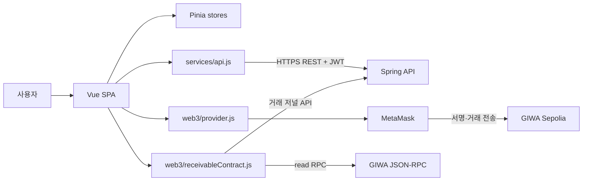
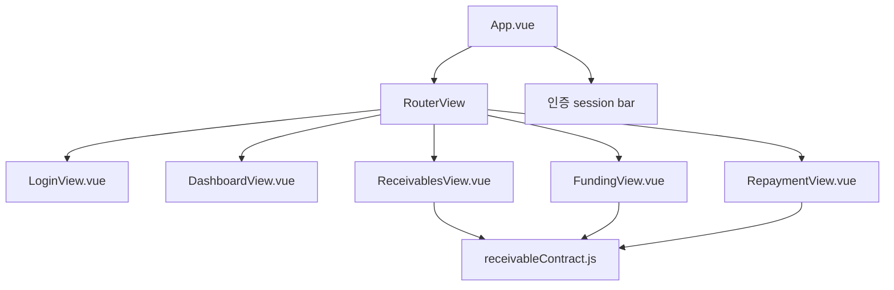
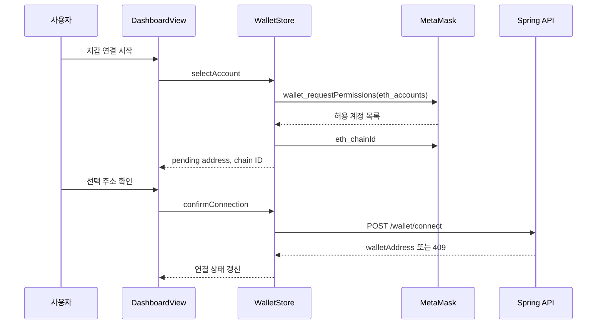
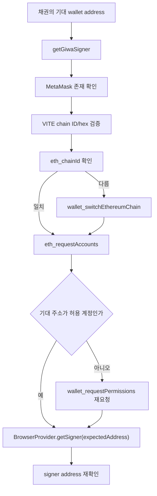
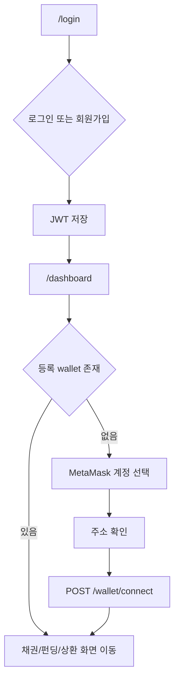
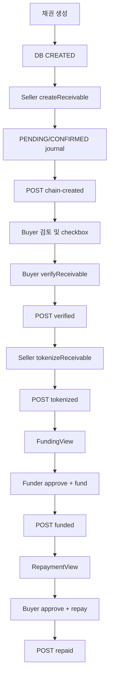
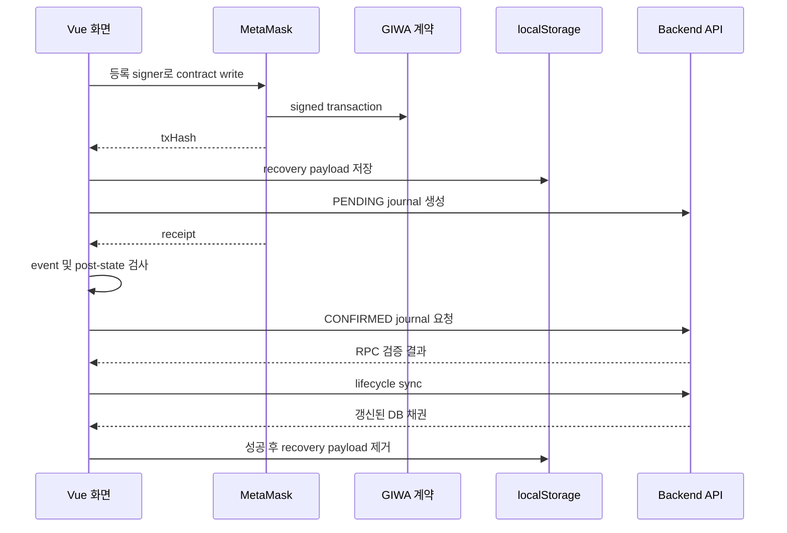

# 프런트엔드 설계

## 문서 탐색

[최종 백서](./WHITEPAPER.md) | [프로젝트 분석](./PROJECT_ANALYSIS.md) | [시스템 아키텍처](./SYSTEM_ARCHITECTURE.md) | [스마트 컨트랙트](./SMART_CONTRACT_DESIGN.md) | [백엔드](./BACKEND_DESIGN.md) | [보안 및 기술 의사결정](./SECURITY_AND_TECHNICAL_DECISIONS.md) | [백서 초안](./WHITEPAPER_DRAFT.md)

## 1. 범위와 기술 구성

- 대상 모듈은 `giwa-ui`이다.
- Vue 3 Composition API, Vite, Vue Router, Pinia, ethers.js v6, PrimeVue 4, Aura theme, PrimeIcons를 사용한다.
- Vite 설정은 Vue plugin과 `vite-plugin-vue-devtools`를 포함한다.
- 프런트엔드는 REST API를 통해 인증·DB 상태·거래 저널을 처리하고, MetaMask를 통해 모든 온체인 쓰기 거래를 서명·전송한다.
- 프런트엔드는 개인키, seed phrase, 배포자 키를 저장하지 않는다.

## 2. Vue 아키텍처

### 2.1 Application Bootstrap

| 파일 | 구현 |
| --- | --- |
| `src/main.js` | Vue application 생성, Pinia·router·PrimeVue 설치, Aura theme와 PrimeIcons CSS 등록 |
| `src/App.vue` | `RouterView`, 인증 경로 공통 session bar, `/auth/me` 로드 조정 |
| `src/assets/base.css`, `src/assets/main.css` | 전역 스타일 |
| `src/contracts/addresses.js` | Vite 환경변수 기반 네트워크·계약·explorer 설정 |

- `App.vue`는 `route.meta.requiresAuth`와 auth store token을 기준으로 인증 레이아웃을 표시한다.
- 인증 레이아웃은 현재 사용자 email만 표시하고 user ID, company ID, 사업자번호, 지갑 주소는 표시하지 않는다.
- 인증 경로 진입 또는 새로고침 시 사용자 정보가 없으면 `auth.loadUser()`를 호출한다.
- auth store는 같은 token에 대한 동시 `/auth/me` 호출을 하나의 in-flight Promise로 공유한다.

### 2.2 화면 및 컴포넌트 구조

| 화면/컴포넌트 | 책임 |
| --- | --- |
| `LoginView.vue` | 로그인, 회원가입 모드 전환, 사업자번호 표시 포맷과 API payload 정규화 |
| `DashboardView.vue` | 사용자 정보, 등록 지갑 상태, MetaMask 계정 선택 및 매핑 확인, 업무 화면 이동, 로그아웃 |
| `ReceivablesView.vue` | 채권 생성, 목록/상세, Seller chain create, Buyer 검토/verify, Seller tokenization, 저널 기반 복구 |
| `FundingView.vue` | funding 기회 조회, MockKRW readiness, approval, funding, journal/동기화 재시도 |
| `RepaymentView.vue` | Buyer FUNDED 채권 조회, MockKRW readiness, approval, repayment, journal/동기화 재시도 |
| `HelloWorld.vue`, `TheWelcome.vue`, `WelcomeItem.vue` 및 icon 컴포넌트 | Vue 시작 템플릿 잔여 컴포넌트. 업무 라우트에서 사용하지 않음 |
| `HomeView.vue`, `AboutView.vue` | 소스에 존재하나 현재 router에 등록되지 않음 |

- 업무 화면은 각 화면 파일에 Composition API 상태, 사용자 동작, 오류 표시, template, scoped CSS를 함께 둔다.
- `ReceivablesView.vue`는 채권 lifecycle UI와 tokenization recovery를 함께 포함한다.
- `FundingView.vue`와 `RepaymentView.vue`는 각각 approval, readiness, journal recovery, backend sync UI를 화면 내부에 포함한다.
- 기능별 하위 UI 컴포넌트 분해, 공통 transaction composable, 디자인 시스템 컴포넌트 계층은 현재 MVP에서는 구현되지 않았으며 향후 구현 예정입니다.

## 3. Routing

| 경로 | name | component | route meta | guard 동작 |
| --- | --- | --- | --- | --- |
| `/` | 없음 | 없음 | 없음 | `/login`으로 redirect |
| `/login` | `login` | `LoginView.vue` | `guestOnly` | token이 있으면 `dashboard`로 이동 |
| `/dashboard` | `dashboard` | lazy-loaded `DashboardView.vue` | `requiresAuth` | token이 없으면 `login`으로 이동 |
| `/receivables` | `receivables` | lazy-loaded `ReceivablesView.vue` | `requiresAuth` | token이 없으면 `login`으로 이동 |
| `/funding` | `funding` | lazy-loaded `FundingView.vue` | `requiresAuth` | token이 없으면 `login`으로 이동 |
| `/repayment` | `repayment` | lazy-loaded `RepaymentView.vue` | `requiresAuth` | token이 없으면 `login`으로 이동 |

- router는 `createWebHistory(import.meta.env.BASE_URL)`를 사용한다.
- navigation guard는 localStorage token으로 초기화된 auth store의 `isAuthenticated`만 검사한다.
- route guard는 token의 유효성을 사전 검증하지 않는다. 보호 API 응답과 `App.vue`의 `/auth/me` 로드가 실제 사용자 상태를 확인한다.
- 404 catch-all route, token 만료 시 자동 로그아웃 guard, role-based route meta는 현재 MVP에서는 구현되지 않았으며 향후 구현 예정입니다.

## 4. State Management

### 4.1 Pinia Stores

| Store | reactive state | 주요 메서드 | 외부 의존성 |
| --- | --- | --- | --- |
| `useAuthStore` | `token`, `user`, `isAuthenticated` | `login`, `signup`, `loadUser`, `logout` | `apiRequest`, localStorage |
| `useWalletStore` | `walletAddress`, `pendingWalletAddress`, `pendingChainId`, 연결 computed | `loadWallet`, `selectAccount`, `confirmConnection`, `clearPending`, `clear` | `apiRequest`, MetaMask provider |
| `useReceivableStore` | `receivables`, `fundingOpportunities`, `selectedReceivable` | 목록/상세/기회 load, 생성, lifecycle 동기화 | `apiRequest` |
| `useCounterStore` | `count` | increment | 업무 흐름에서 사용하지 않음 |

- auth store는 `accessToken`을 localStorage에서 읽고 로그인/회원가입 성공 시 저장한다.
- logout은 token과 user state, localStorage token만 지운다. 서버 logout endpoint는 없다.
- wallet store의 `pendingWalletAddress`와 `pendingChainId`는 MetaMask 선택 후 사용자가 백엔드 저장을 확인하기 전의 상태다.
- receivable store의 `selectedReceivable`은 상세 조회 및 lifecycle sync 응답으로 갱신된다.
- 채권 거래 복구 상태는 Pinia가 아닌 각 화면의 `receivablePendingBlockchainSync` localStorage record로 관리한다.
- persistence plugin, SSR state hydration, multi-tab state synchronization은 현재 MVP에서는 구현되지 않았으며 향후 구현 예정입니다.

### 4.2 Browser Storage

| 저장소 키/형태 | 작성 주체 | 용도 |
| --- | --- | --- |
| `accessToken` | auth store | Bearer JWT |
| `receivablePendingBlockchainSync` | Receivables/Funding/Repayment 화면 | 회사별 pending/confirmed backend sync 및 거래 복구 정보 |

- 거래 복구 record는 tx hash와 유형뿐 아니라 제출 당시 transaction intent 정보, replacement 관련 정보, scan cursor 등을 보관한다.
- localStorage 레코드는 기기/브라우저별이다.
- 브라우저 저장소 암호화, 서버측 복구 레코드 동기화, token secure cookie 보관은 현재 MVP에서는 구현되지 않았으며 향후 구현 예정입니다.

## 5. API Communication

### 5.1 공통 API Client

| 항목 | `services/api.js` 구현 |
| --- | --- |
| base URL | `VITE_API_URL`, 없으면 `http://localhost:8080`; 끝 슬래시 제거 |
| 인증 | 기본적으로 localStorage `accessToken`을 `Authorization: Bearer` header에 설정 |
| body | FormData 이외 body는 JSON serialize 및 `Content-Type: application/json` 설정 |
| 응답 | JSON content-type이면 body parse |
| 네트워크 오류 | `ApiError(0, "NETWORK_ERROR", ...)` |
| HTTP 오류 | 서버 `status`, `code`, `message`, `fieldErrors` 기반 `ApiError` |

- 모든 store와 `services/blockchainTransactions.js`는 `apiRequest`를 사용한다.
- 각 화면은 `ApiError.code`를 기준으로 지갑/거래 recovery UI를 분기한다.
- axios, GraphQL client, WebSocket client는 없다. 현재 MVP에서는 구현되지 않았으며 향후 구현 예정입니다.

### 5.2 프런트엔드 호출 경로

| 영역 | 호출 |
| --- | --- |
| Auth | `POST /auth/signup`, `POST /auth/login`, `GET /auth/me` |
| Wallet | `GET /wallet/me`, `POST /wallet/connect` |
| Receivable | `POST /receivables`, `GET /receivables`, `GET /receivables/{id}` |
| Funding opportunity | `GET /receivables/funding-opportunities` |
| Lifecycle sync | `POST /receivables/{id}/chain-created`, `/verified`, `/tokenized`, `/funded`, `/repaid` |
| 거래 저널 | `POST /blockchain-transactions`, `PATCH /blockchain-transactions/{txHash}/confirmed`, `/failed`, `GET /receivables/{id}/transactions` |

- `services/blockchainTransactions.js`는 저널 생성/확정/실패/목록 요청을 별도 함수로 제공한다.
- receipt의 block number, gas used, effective gas price는 JavaScript 정밀도 손실을 피하기 위해 문자열로 API에 전달한다.
- API retry queue, offline cache, response cache, API versioning UI는 현재 MVP에서는 구현되지 않았으며 향후 구현 예정입니다.

## 6. Wallet Connection

### 6.1 계정 선택 및 매핑

- MetaMask provider 탐지는 `window.ethereum` 또는 `window.ethereum.providers`에서 `isMetaMask && !isPhantom` provider를 선택한다.
- `wallet_requestPermissions`를 먼저 시도하고 provider가 `-32601`을 반환하면 `eth_requestAccounts`로 fallback한다.
- 선택 후 accounts[0]와 `eth_chainId`를 pending state에 저장한다.
- 사용자가 확인하기 전에는 `/wallet/connect`를 호출하지 않는다.
- `WALLET_ALREADY_MAPPED` 오류가 발생하면 Dashboard 화면은 다른 계정 선택 UX를 제공한다.
- wallet connect 단계에서는 chain ID가 GIWA Sepolia인지 검사하지 않는다. chain ID는 선택 당시 MetaMask가 반환한 값을 서버에 보낸다.

### 6.2 Lifecycle Signer 선택

- `getGiwaSigner(expectedWalletAddress)`는 등록된 기대 주소가 유효한 Ethereum 주소인지 검사한다.
- `VITE_GIWA_CHAIN_ID`와 선택적 `VITE_GIWA_CHAIN_ID_HEX`가 일치하는 양수 값인지 검사한다.
- 현재 network가 다르면 `wallet_switchEthereumChain`을 요청한다. MetaMask에 체인이 없다는 `4902` 오류는 네트워크 추가 안내 오류로 변환한다.
- 기대 주소가 사이트 허용 accounts에 없으면 permissions picker를 한 번 더 열고, 끝내 없으면 `WALLET_MISMATCH` 오류를 반환한다.
- signer 선택은 accounts[0]을 계약 signer로 가정하지 않는다.
- wallet 소유를 backend challenge signature로 증명하는 기능은 현재 MVP에서는 구현되지 않았으며 향후 구현 예정입니다.

## 7. Smart Contract Interaction

### 7.1 계약 설정과 ABI

| 파일 | 내용 |
| --- | --- |
| `contracts/ReceivableFinance.abi.json` | lifecycle 함수, `getReceivable`, events, ERC-721 관련 ABI |
| `contracts/MockKRW.abi.json` | `balanceOf`, `allowance`, `approve`, `decimals`, `Transfer`, `Approval` ABI |
| `contracts/addresses.js` | Finance/MockKRW 주소, GIWA chain/RPC/explorer 환경 설정 |
| `services/web3/receivableContract.js` | ABI 기반 Contract 생성, read/write 및 검증/복구 함수 |

- Finance 및 MockKRW 주소는 Vite 환경변수만 사용한다.
- read-only 사전검증은 `VITE_GIWA_RPC_URL`의 ethers provider를 사용한다.
- 쓰기 거래는 read provider가 아닌 MetaMask `BrowserProvider`의 signer로 Contract instance를 연결한다.
- 설정 누락, zero address, invalid address, RPC network/환경 chain ID 불일치는 `Web3Error`로 처리한다.

### 7.2 컨트랙트 함수별 프런트엔드 사용

| 온체인 함수 | 호출 화면 | 호출 전 검증 | 호출 후 확인 |
| --- | --- | --- | --- |
| `createReceivable` | `ReceivablesView` Seller action | 등록 Seller signer, chain, DB 입력값, 계약 주소 | `ReceivableCreated` event, onchain ID, DB `chain-created` sync |
| `getReceivable` | Receivables/Funding/Repayment 사전검증 | RPC/계약 설정 | DB 당사자·금액·날짜·문서 hash·상태와 비교 |
| `verifyReceivable` | `ReceivablesView` Buyer action | Buyer checkbox, create metadata, Buyer signer, CREATED onchain terms | `ReceivableVerified`, DB `verified` sync |
| `tokenizeReceivable` | `ReceivablesView` Seller action | verify metadata, Seller signer, VERIFIED onchain terms, tokenization journal gate | `ReceivableTokenized`, custodian, DB `tokenized` sync |
| `paymentToken` | Funding/Repayment readiness | Finance address/RPC | 설정 MockKRW 주소와 일치해야 함 |
| `fundReceivable` | `FundingView` Funder action | TOKENIZED terms, ERC-20 decimals 0, escrow owner, balance/allowance | Funded event, MockKRW/NFT Transfer, FUNDED post-state, DB `funded` sync |
| `repayReceivable` | `RepaymentView` Buyer action | FUNDED terms, current NFT owner, balance/allowance | Repaid event, MockKRW Transfer, REPAID post-state, DB `repaid` sync |
| `ownerOf` | Funding/Repayment readiness와 repayment 결과 | token ID | escrow 또는 current owner 확인 |
| MockKRW `approve` | Funding/Repayment approval action | 충분한 balance 및 allowance 부족 | 정확한 Approval event 및 allowance 재조회 |

- Funding approval은 정확히 `fundingAmount`, Repayment approval은 정확히 `faceValue`를 요청한다.
- allowance가 충분하면 approval action을 노출하지 않고 lifecycle action을 가능하게 한다.
- approval receipt 이후 자동으로 fund/repay를 호출하지 않으며, 사용자가 별도 action으로 거래를 제출해야 한다.
- ERC-20 approval은 backend lifecycle 거래 저널에 저장하지 않는다.

### 7.3 Frontend Receipt Validation

| 거래 | frontend receipt 검사 |
| --- | --- |
| CREATE | 하나의 `ReceivableCreated`, Seller/Buyer/금액/날짜/문서 hash 일치 |
| VERIFY | 하나의 `ReceivableVerified`, receivable ID와 Buyer 일치 |
| TOKENIZE | 하나의 `ReceivableTokenized`, ID/token ID/custodian 일치 |
| FUND | 하나의 `ReceivableFunded`, 하나의 Finance NFT `Transfer`, 하나의 MockKRW `Transfer`; ID, token, Funder, Seller, 금액 일치 |
| REPAY | 하나의 `ReceivableRepaid`, 하나의 MockKRW `Transfer`; Buyer, current owner, face value 일치 |

- frontend receipt 검증은 backend RPC 검증을 대체하지 않는다.
- backend가 CONFIRMED 저널을 반환한 후 lifecycle sync API를 호출한다.
- frontend는 MetaMask 거래가 성공하고 backend sync만 실패한 경우 tx hash를 보관하고 sync만 재시도한다.

## 8. UI Flow

### 8.1 인증과 지갑 연결

- 회원가입 form은 email, password, user name, company name, `123-45-67890` 표시 형식의 사업자번호를 입력받는다.
- API payload의 사업자번호는 `normalizeBusinessNumber`로 숫자 10자리로 변환한다.
- Dashboard는 mount 시 auth user와 mapped wallet을 조회한다.

### 8.2 매출채권 Lifecycle UI

- `ReceivablesView`는 Buyer-owned CREATED 채권을 우선 선택하고, 없으면 첫 visible 채권을 선택한다.
- Buyer 검토 checkbox는 화면 local state이며 별도 backend approval로 저장하지 않는다.
- Seller chain creation metadata가 없으면 Buyer verify CTA를 disabled 상태로 보이며, Buyer는 terms를 읽고 새로고침할 수 있다.
- tokenization CTA는 Seller, VERIFIED, create/verify metadata 완료 및 tokenization journal gate 통과 조건에서만 가능하다.
- explorer URL이 설정되면 contract address와 lifecycle transaction hash에 explorer link를 표시한다.
- 매출채권 수정, 삭제, 파일 문서 첨부 UI는 현재 MVP에서는 구현되지 않았으며 향후 구현 예정입니다.

### 8.3 Funding UI

- `FundingView`는 `GET /receivables/funding-opportunities`로 backend가 필터링한 미배정 TOKENIZED 후보를 로드한다.
- 선택된 후보는 Seller/Buyer/Funder, face value, funding amount, maturity date, document hash, token ID, 기대 차액을 표시한다.
- readiness 조회는 payment token 주소, decimals=0, DB/onchain terms, TOKENIZED status, Funder가 zero address, NFT escrow owner, Funder MockKRW balance/allowance를 검사한다.
- 잔액이 `fundingAmount`보다 작으면 approval과 funding 쓰기 action을 모두 차단한다.
- allowance가 부족하면 approval만 허용하고, receipt 검증 및 allowance 재조회 이후 별도 funding action을 허용한다.

### 8.4 Repayment UI

- `RepaymentView`는 현재 회사가 Buyer인 `FUNDED` 채권만 obligation으로 계산한다.
- 선택된 채권에 대해 face value, maturity date, 등록 Buyer wallet, current NFT owner, MockKRW balance/allowance를 표시한다.
- readiness 조회는 payment token, decimals=0, DB/onchain terms, FUNDED status, token ID, 저장된 onchain Funder, current NFT owner를 검사한다.
- allowance가 부족하면 face value만큼 approval을 먼저 요구하고, receipt 확인 후 별도 repayment action을 제공한다.
- maturity date는 표시와 onchain terms 비교에 사용하지만 client-side 상환 가능 시점 제한에는 사용하지 않는다.

## 9. Transaction Flow와 Recovery

### 9.1 공통 거래 흐름

- `receivableContract.js`는 `createPendingBlockchainTransaction`, `confirmBlockchainTransaction`, `failBlockchainTransaction`을 호출한다.
- `confirmedTransaction`은 receipt를 최대 60초 동안 1 confirmation으로 대기한다.
- receipt timeout, RPC/API network failure, pending confirmation depth, reorg 가능성은 lifecycle 호출을 새로 제출하지 않고 recovery 대상으로 남긴다.
- backend가 definitive revert 또는 deterministic proof mismatch로 FAILED를 반환하면 local recovery record를 제거한다.

### 9.2 Tokenization Journal Gate

- `ReceivablesView`는 VERIFIED 채권에 대한 새 mint CTA를 보여 주기 전에 `/receivables/{id}/transactions`에서 TOKENIZE 저널을 조회한다.
- 오래된 CONFIRMED TOKENIZE 행은 더 최신 PENDING/FAILED 행보다 우선한다.
- CONFIRMED TOKENIZE 저널이 있지만 DB가 VERIFIED이면 MetaMask 재호출 대신 backend-only tokenized sync action을 제공한다.
- PENDING TOKENIZE 저널이 있으면 새 mint를 disabled로 두고 기존 hash의 receipt recovery를 시도한다.
- 저널 조회 실패 시 새 mint를 허용하지 않고 retry action을 제공한다.
- 이 gate는 이미 browser 또는 server에 기록된 hash를 보호하지만, 서로 다른 브라우저가 hash를 제출하기 전의 동시 호출을 원자적으로 차단하지는 않는다.

### 9.3 Replacement 및 Reload Recovery

| 상황 | 구현 |
| --- | --- |
| ethers replacement receipt 제공 | replacement hash를 PENDING→CONFIRMED 처리하고 원 hash를 `TRANSACTION_REPLACED`로 FAILED 처리 |
| 원 hash RPC 조회 가능 | ethers replacement detection 사용 |
| 원 hash RPC 조회 불가 | 저장된 sender/nonce 또는 exact calldata intent로 제한된 canonical block 범위 scan |
| 성공 receipt + backend sync 실패 | tx hash/event payload 유지, backend sync만 재시도 |
| confirmed journal + DB 미동기화 | backend-only sync action |
| pending journal | 기존 transaction confirmation recovery |

- legacy hash-only recovery는 제한된 block history에서만 scan한다.
- 서로 다른 기기/브라우저 간의 atomic intent lease, 서버가 생성한 transaction intent lock은 현재 MVP에서는 구현되지 않았으며 향후 구현 예정입니다.

## 10. Error Handling

### 10.1 오류 모델

| 오류 출처 | 프런트엔드 모델 | 처리 방식 |
| --- | --- | --- |
| REST network 실패 | `ApiError` code `NETWORK_ERROR` | 사용자 메시지, 재시도 상태 유지 |
| REST HTTP 실패 | `ApiError(status, code, message, fieldErrors)` | code 기반 UX 분기 |
| MetaMask/ethers 오류 | `Web3Error` | `normalizeWeb3Error`를 통해 코드와 메시지 변환 |
| contract receipt/이벤트 불일치 | `Web3Error` | terminal 또는 recovery action 분기 |
| backend 거래 저널 오류 | backend stable error code | PENDING, FAILED, retryable, sync mismatch 분기 |

### 10.2 주요 오류 분기

| code 또는 상황 | UI 동작 |
| --- | --- |
| `WALLET_ALREADY_MAPPED` | pending 지갑 주소를 유지하고 다른 account selection 안내 |
| MetaMask `4001` | 사용자 취소 메시지 |
| MetaMask 미설치 | provider 설치/활성화 메시지 |
| `WRONG_NETWORK` | GIWA network 전환 또는 추가 안내 |
| `WALLET_MISMATCH` | 기대 등록 주소와 현재 허용 주소를 오류 context로 표시 |
| `TRANSACTION_REPLACED` | replacement hash recovery 또는 원 거래 failed 기록 |
| backend RPC pending/reorg/configuration 계열 | local record 유지, backend-only retry |
| backend terminal failed | local record 제거, backend 오류 표시 |
| `BLOCKCHAIN_SYNCHRONIZATION_EVENT_MISMATCH` | backend sync 실패가 아닌 receipt recovery로 전환 |

- 화면은 server error message 문자열 분석이 아니라 stable code를 사용해 특수 흐름을 분기한다.
- global Vue error boundary, Sentry 등 외부 오류 수집, 사용자 알림 센터는 현재 MVP에서는 구현되지 않았으며 향후 구현 예정입니다.

## 11. 구현되지 않은 범위

- document upload/download, object storage 연동, 문서 검증 UI는 현재 MVP에서는 구현되지 않았으며 향후 구현 예정입니다.
- token refresh, MFA, secure httpOnly cookie 기반 인증 저장소는 현재 MVP에서는 구현되지 않았으며 향후 구현 예정입니다.
- 404 route, 권한별 route guard, 다국어 처리, 접근성 테스트 자동화는 현재 MVP에서는 구현되지 않았으며 향후 구현 예정입니다.
- WebSocket 기반 상태 push, 블록체인 indexer 연동, background receipt worker, multi-device transaction recovery는 현재 MVP에서는 구현되지 않았으며 향후 구현 예정입니다.
- 매출채권 수정·삭제, 관리자 화면, 회사 관리, 검색·pagination UI, NFT portfolio UI는 현재 MVP에서는 구현되지 않았으며 향후 구현 예정입니다.
