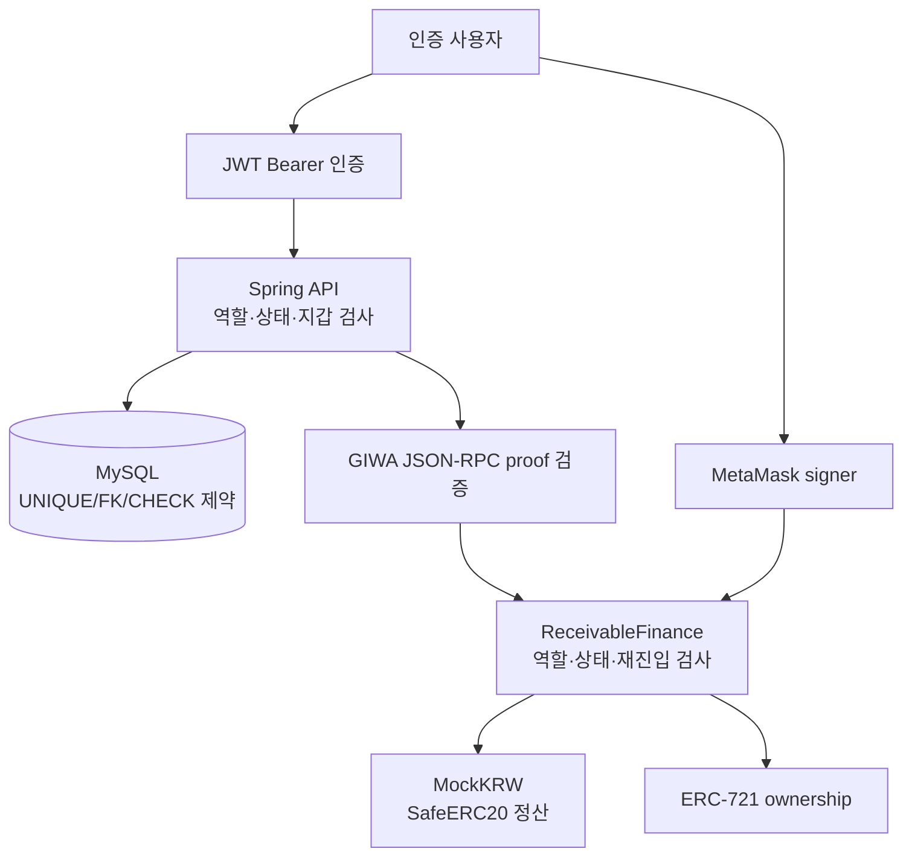
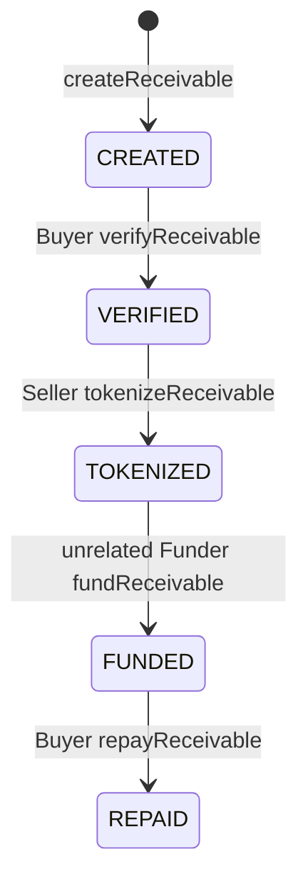
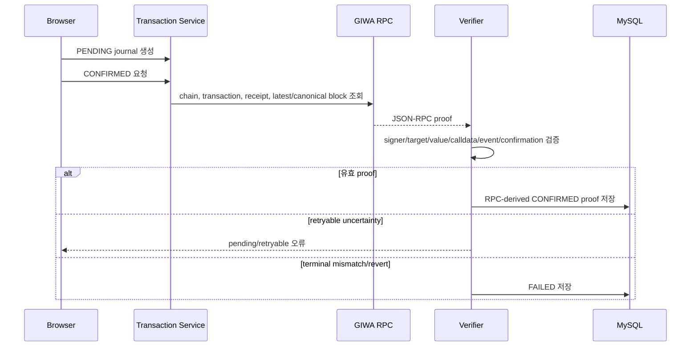

# 보안 및 기술 의사결정

## 문서 탐색

[최종 백서](./WHITEPAPER.md) | [프로젝트 분석](./PROJECT_ANALYSIS.md) | [시스템 아키텍처](./SYSTEM_ARCHITECTURE.md) | [스마트 컨트랙트](./SMART_CONTRACT_DESIGN.md) | [백엔드](./BACKEND_DESIGN.md) | [프런트엔드](./FRONTEND_DESIGN.md) | [백서 초안](./WHITEPAPER_DRAFT.md)

## 1. 범위

- 본 문서는 저장소의 Solidity, Spring Boot, Vue, SQL 스키마, Hardhat 설정, `docs/ai/DECISIONS.md`, 배포 문서에 확인되는 보안 통제와 기술 의사결정을 기록한다.
- 문서에 명시된 사유와 소스에서 확인 가능한 구현 사실을 구분한다.
- 저장소에 명시적 사유가 없는 기술 선택은 사유를 추정하지 않는다.
- 프로젝트는 GIWA Hackathon용 매출채권 금융 MVP이며 실제 금융 서비스가 아니다.

## 2. 보안 모델

| 계층 | 보호 대상 | 구현 통제 |
| --- | --- | --- |
| 브라우저 | 개인키, signer 선택 | MetaMask signer 사용, private key 미저장, 등록 지갑 주소 일치 검사 |
| API 인증 | 보호 REST API | stateless JWT, Spring Security filter chain, 401/403 분리 |
| 업무 서비스 | 회사·역할·상태·저널 무결성 | 사용자/회사 재조회, 조건부 SQL UPDATE, 멱등성·충돌 검사 |
| DB | 지갑·거래 hash·채권 관계 | UNIQUE, FK, CHECK, 상태 이력, 검증 version |
| RPC verifier | DB 상태와 온체인 거래의 결합 | calldata, actor, receipt, event, block, confirmations, ERC-20/ERC-721 Transfer 검증 |
| Solidity | 온체인 상태·자산 이동 | 역할 검사, 상태 머신, `nonReentrant`, `SafeERC20`, custom errors |

## 3. 스마트 컨트랙트 보안

### 3.1 ReentrancyGuard

| 항목 | 구현 |
| --- | --- |
| 적용 컨트랙트 | `ReceivableFinance` |
| 상속 | OpenZeppelin `ReentrancyGuard` |
| 적용 함수 | `fundReceivable`, `repayReceivable` |
| 보호 경로 | `paymentToken.safeTransferFrom` 외부 ERC-20 호출을 포함하는 정산 함수 |

- 두 함수는 `nonReentrant` modifier를 사용한다.
- `fundReceivable`은 Funder, 상태, NFT 에스크로 정보를 갱신한 뒤 ERC-20 transfer와 ERC-721 `_safeTransfer`를 수행한다.
- `repayReceivable`은 현재 NFT owner를 읽고 상태를 `REPAID`로 변경한 뒤 ERC-20 transfer를 수행한다.
- 후속 ERC-20/ERC-721 작업이 revert하면 EVM 트랜잭션 전체가 rollback되어 상태 변경도 유지되지 않는다.
- `createReceivable`, `verifyReceivable`, `tokenizeReceivable`은 외부 ERC-20 호출이 없고 `nonReentrant`가 적용되지 않는다.
- pause 또는 emergency stop은 현재 MVP에서는 구현되지 않았으며 향후 구현 예정입니다.

### 3.2 SafeERC20

| 항목 | 구현 |
| --- | --- |
| 적용 컨트랙트 | `ReceivableFinance` |
| 라이브러리 | OpenZeppelin `SafeERC20` |
| 대상 타입 | `IERC20 paymentToken` |
| 호출 | `paymentToken.safeTransferFrom` |
| 사용 단계 | Funder→Seller 펀딩금 지급, Buyer→현재 NFT owner 상환금 지급 |

- `fundReceivable`은 `fundingAmount`를 caller에서 Seller로 직접 이동시킨다.
- `repayReceivable`은 `faceValue`를 Buyer에서 `ownerOf(tokenId)`가 반환한 수취인으로 직접 이동시킨다.
- Finance 컨트랙트는 MockKRW 잔액을 custody하지 않는다.
- SafeERC20 호출 실패는 lifecycle 상태 변경을 포함한 현재 EVM 트랜잭션을 revert한다.
- fee-on-transfer, rebasing, non-standard ERC-20의 경제적 결과를 별도로 검증하지 않는다. 현재 MVP에서는 구현되지 않았으며 향후 구현 예정입니다.

### 3.3 Access Control

| 대상 | 접근 조건 | 실패 |
| --- | --- | --- |
| `MockKRW.mint` | `Ownable.onlyOwner` | OpenZeppelin ownership revert |
| `createReceivable` | 모든 caller 가능; caller가 Seller로 저장 | Buyer/금액/날짜 입력 오류 시 custom error |
| `verifyReceivable` | 저장된 Buyer만 | `UnauthorizedCaller` |
| `tokenizeReceivable` | 저장된 Seller만 | `UnauthorizedCaller` |
| `fundReceivable` | 저장된 Seller와 Buyer 이외 주소만 | `RelatedPartyCannotFund` |
| `repayReceivable` | 저장된 Buyer만 | `UnauthorizedCaller` |
| `getReceivable` | 모든 caller | 존재하지 않는 ID면 `ReceivableNotFound` |

- `ReceivableFinance`는 `Ownable`을 상속하지 않으며 admin, operator, upgrader 역할이 없다.
- Seller, Buyer, Funder 역할은 role mapping이 아닌 개별 `Receivable` 구조체의 address와 `msg.sender` 비교로 결정된다.
- `MockKRW` 배포자는 초기 owner이며 owner만 데모 자금을 mint할 수 있다.
- 다중 서명, role delegation, timelock, pause guardian은 현재 MVP에서는 구현되지 않았으며 향후 구현 예정입니다.

### 3.4 Input Validation

| 함수 | 검증 |
| --- | --- |
| `ReceivableFinance` constructor | payment token address가 zero address가 아님 |
| `createReceivable` | Buyer가 zero/self가 아님; face value/funding amount 양수; funding amount가 face value 이하; maturity date가 issue date 초과 |
| ID 기반 lifecycle 함수 | `_getReceivable`에서 `id != 0` 확인 |
| `MockKRW.mint` | `onlyOwner`; ERC-20 `_mint`의 zero address 수취인 방지 |

- `documentHash`는 `bytes32` 값으로 저장되지만 원본 파일 또는 해시 산출 과정을 검증하지 않는다.
- `issueDate`, `maturityDate`는 `uint256` 값 관계만 검사하고 현재 block timestamp와 비교하지 않는다.
- onchain 동일 내용 채권의 중복 생성 방지, 외부 기업·문서 검증, oracle 입력 검증은 현재 MVP에서는 구현되지 않았으며 향후 구현 예정입니다.

### 3.5 Invalid State Protection

| 함수 | 요구 상태 | 상태 불일치 처리 |
| --- | --- | --- |
| `verifyReceivable` | `CREATED` | `InvalidStatus(expected, actual)` |
| `tokenizeReceivable` | `VERIFIED` | `InvalidStatus(expected, actual)` |
| `fundReceivable` | `TOKENIZED` | `InvalidStatus(expected, actual)` |
| `repayReceivable` | `FUNDED` | `InvalidStatus(expected, actual)` |

- `_requireStatus`는 상태가 정확히 일치하지 않으면 custom error로 revert한다.
- 같은 채권의 이중 토큰화, 이중 펀딩, 이중 상환은 이전 상태가 유지되지 않으므로 컨트랙트에서 실패한다.
- `CANCELLED` enum 값은 선언되어 있지만 이를 설정하는 함수가 없다. 현재 MVP에서는 구현되지 않았으며 향후 구현 예정입니다.
- 만기 도래 전 상환 차단, 디폴트·연체·분쟁 상태, 부분 상환 상태는 현재 MVP에서는 구현되지 않았으며 향후 구현 예정입니다.

### 3.6 NFT Ownership Protection

- `tokenizeReceivable`은 NFT를 Seller가 아닌 Finance 컨트랙트 자신에게 `_mint`한다.
- `fundReceivable`은 Finance 에스크로에서 Funder로 `_safeTransfer`한다.
- `_safeTransfer`는 Funder가 contract address일 경우 ERC-721 receiver interface를 요구한다.
- `repayReceivable`은 NFT를 이동하거나 소각하지 않는다.
- FUNDED 이후에는 표준 ERC-721 `transferFrom`/`safeTransferFrom`로 NFT를 제3자에게 이전할 수 있다.
- NFT 양도 제한, allowlist, 상환 후 burn, secondary-market royalty는 현재 MVP에서는 구현되지 않았으며 향후 구현 예정입니다.

## 4. 백엔드 보안

### 4.1 Authentication

| 항목 | 구현 |
| --- | --- |
| login | email 사용자 조회 후 BCrypt password match |
| password storage | `users.password_hash`에 BCrypt hash 저장 |
| token | JJWT HMAC signed JWT |
| JWT subject | email |
| JWT claims | 현재 구현은 subject, issued-at, expiration만 생성 |
| default expiration | 86,400,000 ms |
| security session | `SessionCreationPolicy.STATELESS` |

- JWT filter는 Bearer token을 parse해 email을 Spring Security principal로 설정한다.
- `/auth/signup`, `/auth/login`, `/health`, `/error`와 ERROR dispatcher를 제외한 경로는 인증이 필요하다.
- 유효하지 않은 token은 security context를 비우고 보호 경로에서 `401 AUTHENTICATION_REQUIRED`로 처리한다.
- CSRF는 disabled이며 인증 정보는 cookie가 아닌 Authorization header에 전달한다.
- refresh token, token revocation, MFA, 로그인 시도 제한, password reset은 현재 MVP에서는 구현되지 않았으며 향후 구현 예정입니다.

### 4.2 API Authorization 및 Wallet Mapping

| 통제 | 구현 |
| --- | --- |
| REST 일반 접근 | Spring Security가 인증 여부를 검사 |
| lifecycle 역할 | service가 인증 email의 company ID와 Seller/Buyer/Funder company ID 비교 |
| 저장 wallet | lifecycle 거래의 기대 wallet이 인증 회사에 매핑되어 있는지 검사 |
| wallet uniqueness | `company_wallets.wallet_address` 전역 UNIQUE 및 service 검사 |
| wallet conflict | 다른 회사 매핑 시 `409 WALLET_ALREADY_MAPPED`, 소유 회사 정보 비노출 |
| funding 관계 배제 | Seller 또는 Buyer 회사의 funding 요청을 거부 |
| 거래 저널 소유권 | 제출 회사만 CONFIRMED/FAILED 처리 가능 |

- 동일 회사의 동일 wallet 재연결은 멱등적이며 chain ID를 갱신할 수 있다.
- frontend는 MetaMask에서 등록 지갑 signer를 선택하지만, backend wallet connect API는 별도 message signature challenge를 검증하지 않는다. 현재 MVP에서는 구현되지 않았으며 향후 구현 예정입니다.
- 다중 wallet policy, wallet disconnect, wallet rotation audit policy는 현재 MVP에서는 구현되지 않았으며 향후 구현 예정입니다.

### 4.3 RPC Proof 검증

| 검증 항목 | 구현 |
| --- | --- |
| network | RPC chain ID와 설정 chain ID 일치 |
| transaction | hash, signer, target Finance 주소, zero native value |
| receipt/block | receipt 성공, transaction/receipt hash 및 block hash, canonical block, confirmation depth |
| calldata | transaction type별 ABI selector와 전체 기대 인자 |
| lifecycle event | 설정 Finance 주소에서 정확히 하나의 기대 event |
| TOKENIZE | `ReceivableTokenized`와 ERC-721 mint Transfer |
| FUND | `ReceivableFunded`, MockKRW Funder→Seller Transfer, ERC-721 escrow→Funder Transfer |
| REPAY | `ReceivableRepaid`, MockKRW Buyer→event recipient face-value Transfer |

- client가 전달하는 block/gas 값은 transport validation용 힌트다. CONFIRMED 저장값은 RPC proof에서 도출한다.
- lifecycle sync 직전에는 이미 검증된 CONFIRMED 거래도 다시 RPC 검증한다.
- `verification_version` compare-and-set으로 동시에 도착한 오래된 proof 결과가 최신 proof를 덮어쓰지 못하게 한다.
- blockchain indexer, event subscription, 독립 reconciliation worker는 현재 MVP에서는 구현되지 않았으며 향후 구현 예정입니다.

### 4.4 Database Integrity

| 대상 | 제약 또는 처리 |
| --- | --- |
| company | business number UNIQUE |
| user | email UNIQUE, company FK |
| wallet | wallet address UNIQUE, company FK |
| receivable | Seller/Buyer 상이성, 양수 금액, funding amount 상한, 날짜 순서 CHECK |
| onchain metadata | `(contract_address, onchain_receivable_id)`, create/verify hash UNIQUE |
| journal | tx hash 전역 UNIQUE, company/receivable FK |
| 상태 변경 | lifecycle status/actor/metadata 조건을 포함한 SQL UPDATE |
| concurrency | `verification_version` CAS 및 상태 조건부 갱신 |

- lifecycle 단계 메타데이터가 이미 같은 값으로 반영된 재시도는 멱등적으로 처리한다.
- 다른 metadata/hash의 재사용은 conflict 오류로 처리한다.
- schema migration은 자동 실행하지 않으며 기존 DB에는 사전 검사와 수동 migration이 필요하다.

### 4.5 Error Exposure

- API 오류 모델은 `status`, `code`, `message`, `path`, `timestamp`, `fieldErrors`를 가진다.
- Security authentication/authorization 실패는 각각 `401 AUTHENTICATION_REQUIRED`, `403 ACCESS_DENIED`다.
- Bean validation은 `400 VALIDATION_FAILED`, 잘못된 JSON은 `400 INVALID_REQUEST_BODY`, DB constraint conflict는 `409 DATA_CONFLICT`로 변환한다.
- 처리되지 않은 예외는 `500 INTERNAL_SERVER_ERROR`와 사용자용 일반 메시지로 응답하고 server log에 상세를 남긴다.
- central audit log, SIEM, rate limiting, WAF, distributed trace는 현재 MVP에서는 구현되지 않았으며 향후 구현 예정입니다.

## 5. 프런트엔드 보안

| 통제 | 구현 |
| --- | --- |
| signer | MetaMask `BrowserProvider`에서 기대 등록 address의 signer 요청 |
| network | VITE decimal/hex chain ID 일치 검사 및 `wallet_switchEthereumChain` 시도 |
| account selection | `wallet_requestPermissions` 후 기대 account 재검사 |
| contract config | missing/invalid/zero address를 configuration error로 처리 |
| transaction recovery | hash와 intent 정보를 localStorage에 저장하고 재제출 대신 recovery/sync 수행 |
| API error | stable backend code 기반 UI 분기 |
| approval | Approval과 fund/repay를 별도 사용자 action으로 분리 |

- 프런트엔드는 Funding/Repayment 전에 MockKRW 주소, decimals=0, onchain terms, NFT owner, balance, allowance를 조회한다.
- receipt 이벤트 검증은 UX 보호에 사용하며 backend RPC proof 검증을 대체하지 않는다.
- JWT와 거래 recovery record는 localStorage에 저장된다.
- CSP, Subresource Integrity, XSS 방어 정책, localStorage 암호화, httpOnly cookie 인증 저장소는 현재 MVP에서는 구현되지 않았으며 향후 구현 예정입니다.

## 6. 기술 의사결정

### 6.1 명시된 ADR

| ADR | 결정 | 문서에 기록된 이유 | 구현 |
| --- | --- | --- | --- |
| ADR-001 | 모든 쓰기 거래에 MetaMask 사용 | 개인키를 저장하지 않기 위함 | ethers `BrowserProvider`/등록 address signer로 모든 contract write 수행 |
| ADR-002 | Wallet address를 Company에 매핑 | 인증은 Web2에 남기고 blockchain은 ownership만 검증 | `company_wallets`, JWT user→company, wallet uniqueness |
| ADR-003 | NFT의 초기 소유자는 Finance 컨트랙트 | Seller approval 거래 제거 | `tokenizeReceivable`의 `_mint(address(this), tokenId)` |
| ADR-004 | Single Funder 모델 | MVP 단순화 | `Receivable.funder` 단일 address, 단일 `fundReceivable` 전이 |
| ADR-005 | Backend는 거래 metadata만 저장 | blockchain을 source of truth로 유지 | tx journal과 RPC proof 저장, backend 서명/전송 없음 |
| ADR-006 | MockKRW는 0 decimals, 1 base unit=1 KRW | DB `DECIMAL(36,0)`과 UI/컨트랙트 간 18-decimal scaling 오류 방지 | `MockKRW.decimals() = 0`, 정수 금액 검증 |

### 6.2 NFT 및 ERC-721

| 항목 | 저장소에 확인되는 선택 이유 | 구현 결과 |
| --- | --- | --- |
| NFT 사용 | 매출채권을 ERC-721 NFT로 토큰화하는 MVP 목표 | 채권 tokenization 시 1개 NFT 발행 |
| ERC-721 사용 | 문서에서 매출채권 토큰화 수단으로 명시 | OpenZeppelin `ERC721`, token ID별 소유자 추적 |
| Finance 에스크로 | Seller approval 거래 제거 | TOKENIZED에서 Finance가 NFT 소유, FUND에서 Funder 이전 |
| 상환 수취인 | current NFT owner repayment으로 설계 | `ownerOf(tokenId)` 수취인에게 face value 전송 |

- ERC-1155, ERC-20 fractionalization, permissioned transfer와 비교한 선택 사유는 저장소에 기록되어 있지 않다.
- NFT metadata URI, document-backed token metadata, NFT transfer restriction은 현재 MVP에서는 구현되지 않았으며 향후 구현 예정입니다.

### 6.3 GIWA 및 Solidity/Hardhat

| 항목 | 저장소에 확인되는 사실 | 명시된 선택 사유 |
| --- | --- | --- |
| 네트워크 | GIWA Sepolia, chain ID 91342 | GIWA Hackathon MVP의 target network로 기록됨 |
| Solidity | 0.8.24, optimizer 200 runs, viaIR disabled, Paris EVM | 재현 가능한 compile/deploy/verify 설정으로 고정됨 |
| OpenZeppelin | 5.4.0 | ERC-20, ERC-721, Ownable, SafeERC20, ReentrancyGuard 사용 |
| Hardhat | compile, local test, deploy, verify | local solc와 동일 설정으로 배포·검증 수행 |

- GIWA 대신 다른 EVM network를 선택하지 않은 상세 비교 사유는 저장소에 기록되어 있지 않다.
- public RPC rate limit이 문서에 기록되어 있으며 `GIWA_RPC_URL` override를 지원한다.

### 6.4 Spring Boot

| 항목 | 저장소에 확인되는 구현 | 명시된 선택 사유 |
| --- | --- | --- |
| framework | Spring Boot 4.1.0, Java 17 | 별도 ADR 사유 없음 |
| persistence | MyBatis annotation SQL | 별도 ADR 사유 없음 |
| security | Spring Security + JJWT + BCrypt | Web2 authentication을 유지하는 ADR-002와 일치 |
| blockchain verification | Java HTTP JSON-RPC client와 server-side verifier | backend가 거래에 서명하지 않고 proof를 검증 |

- Spring Boot와 다른 backend framework의 비교·선정 기준은 저장소에 기록되어 있지 않다.
- backend가 contract transaction을 직접 보내거나 private key를 보관하는 구조는 현재 MVP에서는 구현되지 않았으며 향후 구현 예정입니다.

### 6.5 Vue 및 Vite

| 항목 | 저장소에 확인되는 구현 | 명시된 선택 사유 |
| --- | --- | --- |
| frontend | Vue 3 Composition API, Vite | 별도 ADR 사유 없음 |
| state | Pinia auth/wallet/receivable stores | 업무 상태와 API 호출 관리 |
| web3 | ethers.js v6 | MetaMask provider/signer와 Contract interaction |
| UI | PrimeVue, Aura, PrimeIcons | dependency로 사용 |

- Vue/Vite와 다른 frontend stack의 비교·선정 기준은 저장소에 기록되어 있지 않다.
- SSR, native mobile application, desktop application은 현재 MVP에서는 구현되지 않았으며 향후 구현 예정입니다.

### 6.6 Railway 및 Vercel

| 항목 | 저장소에 확인되는 구현 | 명시된 선택 사유 |
| --- | --- | --- |
| Railway | Java 17 Dockerfile backend runtime, Railway `PORT`/`MYSQL*` 지원 | 배포 문서에서 backend 배포 대상으로 사용 |
| Vercel | Vite frontend deployment, `VITE_API_URL` build-time 설정 | 배포 문서에서 SPA 배포 대상으로 사용 |
| CORS | exact origin 목록을 `CORS_ALLOWED_ORIGINS`로 설정 | Vercel browser origin의 API 호출 허용 |

- Railway와 Vercel을 선택한 비용, 성능, 운영 비교 사유는 저장소에 기록되어 있지 않다.
- CI/CD pipeline, IaC, 배포 approval, secret manager integration은 현재 MVP에서는 구현되지 않았으며 향후 구현 예정입니다.

### 6.7 MySQL

| 항목 | 저장소에 확인되는 구현 | 명시된 선택 사유 |
| --- | --- | --- |
| database | MySQL 8 schema, MyBatis JDBC datasource | backend stack으로 명시 |
| 정수 KRW | `DECIMAL(36,0)` | MockKRW 0 decimal과 동일 단위 유지 |
| integrity | FK, UNIQUE, CHECK, lifecycle conditional UPDATE | 관계 및 metadata 충돌 방지 |
| migration | 초기 destructive schema와 기존 DB용 수동 migration | 기존 데이터 보존을 위해 non-destructive migration 제공 |

- MySQL과 다른 관계형/비관계형 DB의 비교·선정 기준은 저장소에 기록되어 있지 않다.
- migration 자동 실행, DB backup 자동화, point-in-time recovery 절차 자동화는 현재 MVP에서는 구현되지 않았으며 향후 구현 예정입니다.

### 6.8 MetaMask

| 항목 | 저장소에 확인되는 구현 | 문서에 기록된 이유 |
| --- | --- | --- |
| 모든 write signer | `getGiwaSigner(expectedWalletAddress)` | 개인키를 저장하지 않음 |
| 계정 선택 | `wallet_requestPermissions`, `eth_requestAccounts` fallback | 등록 wallet과 실제 signer를 일치시킴 |
| network | required chain 확인 및 switch 요청 | GIWA Sepolia 거래 전송 |
| recovery | MetaMask tx hash/receipt/replacement 정보 사용 | reload·replacement 이후 중복 거래 방지 |

- WalletConnect, hardware wallet, smart account, account abstraction, gas sponsorship은 현재 MVP에서는 구현되지 않았으며 향후 구현 예정입니다.

## 7. 잔여 위험

| 위험 | 현재 상태 | 영향 |
| --- | --- | --- |
| 실제 금융 통제 부재 | real payment, KYC, credit scoring, oracle가 없음 | 실제 금융 서비스로 사용할 수 없음 |
| mint 권한 집중 | MockKRW owner가 임의 amount mint 가능 | 데모 토큰 공급과 잔액 신뢰가 owner에 의존 |
| wallet ownership proof 부재 | wallet connect 시 backend 서명 challenge 없음 | API 매핑 요청 주소의 실제 제어를 backend만으로 증명하지 않음 |
| JWT localStorage | access token이 browser localStorage에 있음 | XSS 발생 시 token 탈취 위험이 존재 |
| 기본 JWT secret | `application.yml`에 local fallback 존재 | 운영에서 환경변수 미설정 시 예측 가능한 secret 사용 위험 |
| NFT 자유 양도 | FUNDED 후 ERC-721 표준 transfer 허용 | 상환 수취인이 original Funder와 달라질 수 있음 |
| 만기 미강제 | 컨트랙트가 block timestamp를 검사하지 않음 | 만기 전 상환을 막지 않음 |
| 동시 intent | hash 기록 전 다중 browser transaction을 막는 lease 없음 | 두 번째 transaction이 revert되어 gas가 소모될 수 있음 |
| indexer 부재 | browser/API retry가 DB sync를 주도 | 온체인 성공과 DB 상태 간 지연 또는 불일치가 남을 수 있음 |
| RPC 의존성 | public RPC rate limit과 availability 영향 | proof 확인 지연 또는 retry 발생 |
| uint256 표현 범위 | DB/Java onchain ID와 token ID가 `BIGINT UNSIGNED`/`Long` | 전체 uint256 ID 범위를 저장하지 못함 |
| health 범위 | `/health`가 DB/RPC를 검사하지 않음 | service readiness를 보장하지 않음 |
| 배포 자동화 부재 | CI/CD/IaC/secret manager 없음 | 운영 변경의 수동 절차 의존 |

## 8. 향후 개선 항목

- 채권별 server-side intent lease를 도입하여 tokenize, fund, repay의 hash 제출 전 동시 요청을 제어하는 기능은 현재 MVP에서는 구현되지 않았으며 향후 구현 예정입니다.
- 블록체인 indexer 또는 reconciliation worker를 도입하여 lifecycle event와 DB 상태를 독립적으로 동기화하는 기능은 현재 MVP에서는 구현되지 않았으며 향후 구현 예정입니다.
- wallet signature challenge와 session 보안 강화를 도입하는 기능은 현재 MVP에서는 구현되지 않았으며 향후 구현 예정입니다.
- 운영 secret 관리, CI/CD, IaC, migration automation, readiness check를 도입하는 기능은 현재 MVP에서는 구현되지 않았으며 향후 구현 예정입니다.
- KYC/AML, 신용평가, 실결제, oracle 기반 문서 검증, 법적 계약·추심 기능은 현재 MVP에서는 구현되지 않았으며 향후 구현 예정입니다.
- partial funding/repayment, multiple funders, default/late payment, cancellation, permissioned NFT transfer를 도입하는 기능은 현재 MVP에서는 구현되지 않았으며 향후 구현 예정입니다.
- NFT metadata URI, 파일 저장, document hash 원본 검증을 도입하는 기능은 현재 MVP에서는 구현되지 않았으며 향후 구현 예정입니다.
- MockKRW mint 권한에 대한 multi-signature, cap, timelock, audit controls를 도입하는 기능은 현재 MVP에서는 구현되지 않았으며 향후 구현 예정입니다.
