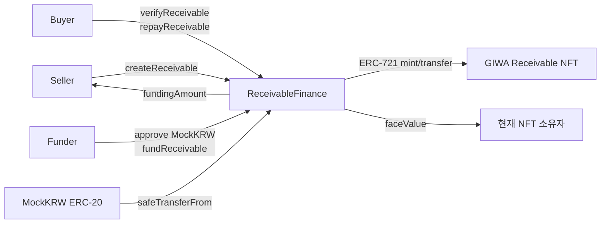
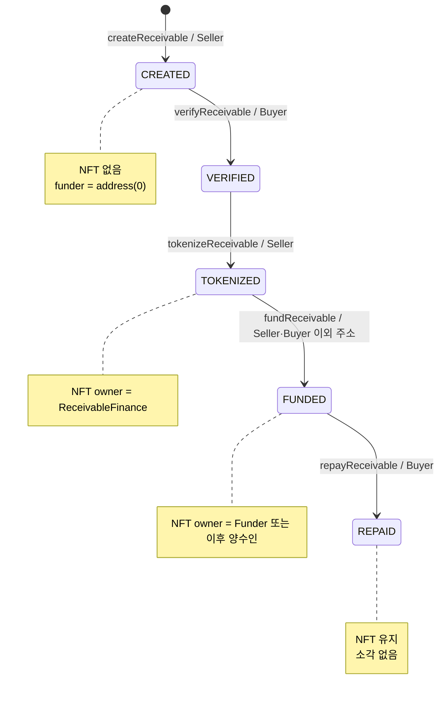
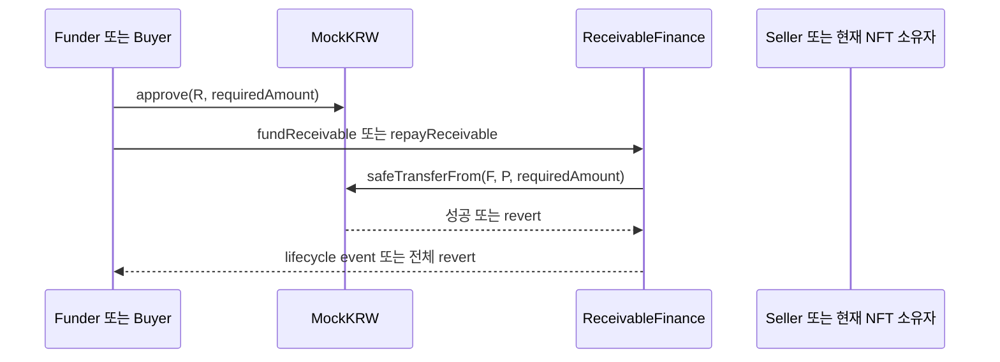

# 스마트 컨트랙트 설계

## 문서 탐색

[최종 백서](./WHITEPAPER.md) | [프로젝트 분석](./PROJECT_ANALYSIS.md) | [시스템 아키텍처](./SYSTEM_ARCHITECTURE.md) | [백엔드](./BACKEND_DESIGN.md) | [프런트엔드](./FRONTEND_DESIGN.md) | [보안 및 기술 의사결정](./SECURITY_AND_TECHNICAL_DECISIONS.md) | [백서 초안](./WHITEPAPER_DRAFT.md)

## 1. 분석 범위

- 분석 대상 소스는 `giwa-contrract/contracts/ReceivableFinance.sol`과 `giwa-contrract/contracts/MockKRW.sol`이다.
- 컴파일러는 Solidity `0.8.24`이며 Hardhat 설정은 optimizer enabled, 200 runs, `viaIR: false`, EVM `paris`다.
- 의존성은 OpenZeppelin Contracts `5.4.0`이다.
- 이 문서는 프로젝트가 직접 선언한 함수와 프로젝트 컨트랙트가 상속으로 외부에 노출하는 표준 인터페이스를 구분한다.

## 2. 전체 설계

| 컨트랙트 | 역할 | 외부 상태 변경 주체 |
| --- | --- | --- |
| `MockKRW` | 테스트용 KRW 단위 ERC-20 결제 토큰 | 배포자 또는 `owner`의 mint, 일반 ERC-20 보유자의 transfer/approve |
| `ReceivableFinance` | 매출채권 상태 머신, ERC-721 NFT 발행/에스크로/이전, MockKRW 정산 | Seller, Buyer, 제3자 Funder |



- `ReceivableFinance`는 배포 시 지정한 ERC-20 주소를 immutable `paymentToken`으로 보관한다.
- Seller의 채권 생성은 온체인 채권 레코드만 만들고 NFT를 발행하지 않는다.
- Buyer 검증 후에만 Seller가 NFT를 발행할 수 있다.
- NFT는 토큰화 직후 Finance 컨트랙트 자신에게 mint되어 에스크로된다.
- Funder의 펀딩은 MockKRW 지급과 NFT 이전을 하나의 EVM 트랜잭션에서 처리한다.
- 상환 수취인은 최초 Funder가 아니라 `ownerOf(tokenId)`로 조회한 현재 NFT 소유자다.
- 실제 KRW 결제, 담보 보관, 준비금, 가격 산정, KYC/AML은 현재 MVP에서는 구현되지 않았으며 향후 구현 예정입니다.

## 3. `ReceivableFinance` 설계

### 3.1 상속 및 라이브러리

| 구성 | 사용 방식 | 영향 |
| --- | --- | --- |
| `ERC721` | `ERC721("GIWA Receivable", "GRCV")` 생성자 호출 | NFT 이름·심볼, 소유권, approve, transfer 표준 인터페이스 제공 |
| `ReentrancyGuard` | `fundReceivable`, `repayReceivable`에 `nonReentrant` 적용 | ERC-20 외부 호출 중 재진입 차단 |
| `IERC20` | `paymentToken` 타입 | 결제 토큰의 ERC-20 인터페이스 사용 |
| `SafeERC20` | `using SafeERC20 for IERC20` | `safeTransferFrom` 호출 시 실패 토큰 처리 |

- 컨트랙트는 `Ownable`, role-based access control, pause 기능을 상속하지 않는다.
- 컨트랙트 수준의 관리자 주소, 관리자 함수, emergency pause 함수는 없다. 현재 MVP에서는 구현되지 않았으며 향후 구현 예정입니다.

### 3.2 상태 머신



| enum 값 | 정수 값 | 도달 경로 | 다음 전이 |
| --- | --- | --- | --- |
| `CREATED` | 0 | `createReceivable` | Buyer의 `verifyReceivable` |
| `VERIFIED` | 1 | `verifyReceivable` | Seller의 `tokenizeReceivable` |
| `TOKENIZED` | 2 | `tokenizeReceivable` | 제3자 Funder의 `fundReceivable` |
| `FUNDED` | 3 | `fundReceivable` | Buyer의 `repayReceivable` |
| `REPAID` | 4 | `repayReceivable` | 없음 |
| `CANCELLED` | 5 | 없음 | 없음 |

- 각 전이는 `_requireStatus`로 직전 상태와 정확히 일치해야 한다.
- `CANCELLED` 상태는 선언되어 있지만 이를 설정하는 함수가 없다. 현재 MVP에서는 구현되지 않았으며 향후 구현 예정입니다.
- 취소, 만기 경과, 디폴트, 부분 상환, 재펀딩, 분할 NFT 전이는 현재 MVP에서는 구현되지 않았으며 향후 구현 예정입니다.

### 3.3 Storage Layout

| 선언 | visibility | 저장 방식 | 용도 |
| --- | --- | --- | --- |
| `IERC20 public immutable paymentToken` | public | constructor 이후 코드/immutable 영역 | 정산에 사용할 ERC-20 주소 |
| `uint256 private _nextReceivableId` | private | storage | 마지막 채권 ID. 신규 생성 시 전위 증가 |
| `uint256 private _nextTokenId` | private | storage | 마지막 NFT token ID. 토큰화 시 전위 증가 |
| `mapping(uint256 => Receivable) private _receivables` | private | storage mapping | 채권 ID별 온체인 업무 상태 |

`ERC721`에서 상속된 NFT ownership, balance, token approval, operator approval storage는 OpenZeppelin `ERC721` 내부에 관리된다. 프로젝트 컨트랙트는 이를 직접 재선언하지 않는다.

| `Receivable` 필드 | 타입 | 생성 시 값 | 이후 변경 함수 |
| --- | --- | --- | --- |
| `id` | `uint256` | 신규 순번 | 변경 없음 |
| `seller` | `address` | `msg.sender` | 변경 없음 |
| `buyer` | `address` | 함수 인자 | 변경 없음 |
| `funder` | `address` | `address(0)` | `fundReceivable` |
| `faceValue` | `uint256` | 함수 인자 | 변경 없음 |
| `fundingAmount` | `uint256` | 함수 인자 | 변경 없음 |
| `issueDate` | `uint256` | 함수 인자 | 변경 없음 |
| `maturityDate` | `uint256` | 함수 인자 | 변경 없음 |
| `documentHash` | `bytes32` | 함수 인자 | 변경 없음 |
| `tokenId` | `uint256` | 0 | `tokenizeReceivable` |
| `status` | `Status` | `CREATED` | 각 lifecycle 함수 |

- `paymentToken`의 public getter는 Solidity가 자동 생성한다.
- `_nextReceivableId`, `_nextTokenId`, `_receivables`에는 직접 public getter가 없다.
- 개별 채권은 `getReceivable`을 통해서만 프로젝트 API로 읽을 수 있다.
- 채권 필드 수정, 당사자 변경, 금액 변경, 문서 해시 변경 함수는 없다. 현재 MVP에서는 구현되지 않았으며 향후 구현 예정입니다.

### 3.4 Events

| 이벤트 | indexed 필드 | non-indexed 필드 | 발생 지점 |
| --- | --- | --- | --- |
| `ReceivableCreated` | `receivableId`, `seller`, `buyer` | `faceValue`, `fundingAmount`, `issueDate`, `maturityDate`, `documentHash` | `createReceivable` |
| `ReceivableVerified` | `receivableId`, `buyer` | 없음 | `verifyReceivable` |
| `ReceivableTokenized` | `receivableId`, `tokenId`, `custodian` | 없음 | `tokenizeReceivable` |
| `ReceivableFunded` | `receivableId`, `tokenId`, `funder` | `seller`, `fundingAmount` | `fundReceivable` |
| `ReceivableRepaid` | `receivableId`, `tokenId`, `buyer` | `recipient`, `faceValue` | `repayReceivable` |

- 토큰화는 프로젝트 lifecycle event와 ERC-721 표준 `Transfer(address(0), address(this), tokenId)`를 함께 발생시킨다.
- 펀딩은 프로젝트 lifecycle event, MockKRW 표준 `Transfer(funder, seller, fundingAmount)`, ERC-721 표준 `Transfer(address(this), funder, tokenId)`를 발생시킨다.
- 상환은 프로젝트 lifecycle event와 MockKRW 표준 `Transfer(buyer, recipient, faceValue)`를 발생시킨다.
- 이벤트만으로 별도 온체인 인덱싱을 수행하는 컨트랙트 구성은 없다. 현재 MVP에서는 구현되지 않았으며 향후 구현 예정입니다.

### 3.5 Errors

| custom error | 발생 조건 |
| --- | --- |
| `InvalidPaymentToken()` | constructor 인자가 zero address |
| `InvalidBuyer()` | Buyer가 zero address이거나 Seller와 동일 |
| `InvalidAmount()` | face value 또는 funding amount가 0이거나 funding amount가 face value 초과 |
| `InvalidDateRange()` | `maturityDate <= issueDate` |
| `ReceivableNotFound(uint256 receivableId)` | mapping 레코드의 `id`가 0 |
| `UnauthorizedCaller(address caller)` | Buyer/Seller 전용 함수의 caller가 저장된 당사자와 다름 |
| `InvalidStatus(Status expected, Status actual)` | lifecycle 함수의 요구 상태 불일치 |
| `RelatedPartyCannotFund()` | Seller 또는 Buyer가 펀딩을 시도 |

- ERC-20 transfer 실패는 `SafeERC20` 및 결제 토큰 구현이 반환하는 revert로 처리된다.
- ERC-721 transfer 수신자가 계약이면 `_safeTransfer`의 ERC-721 receiver 검사에 실패할 수 있다.

### 3.6 Modifiers와 접근 제어

| 제어 수단 | 적용 함수 | 검사 내용 |
| --- | --- | --- |
| 명시적 `msg.sender == receivable.buyer` | `verifyReceivable`, `repayReceivable` | 저장된 Buyer만 실행 |
| 명시적 `msg.sender == receivable.seller` | `tokenizeReceivable` | 저장된 Seller만 실행 |
| 명시적 관련 당사자 배제 | `fundReceivable` | Seller와 Buyer가 아닌 주소만 실행 |
| `_requireStatus` | 모든 ID 기반 lifecycle 함수 | 정확한 상태 전이 순서 |
| `nonReentrant` | `fundReceivable`, `repayReceivable` | 외부 ERC-20 호출 경로 재진입 차단 |

- 프로젝트가 자체 선언한 Solidity modifier는 없다.
- `nonReentrant`는 상속한 `ReentrancyGuard`의 modifier다.
- Seller/Buyer/Funder 역할은 별도 role mapping이 아니라 각 `Receivable` 구조체에 저장된 주소와 `msg.sender` 비교로 판단한다.
- Finance 컨트랙트에는 owner 또는 admin 역할이 없다. 배포자는 생성 이후 lifecycle을 우회하거나 채권을 수정할 수 없다.

## 4. `ReceivableFinance` 함수 상세

### 4.1 Constructor

```solidity
constructor(address paymentTokenAddress)
    ERC721("GIWA Receivable", "GRCV")
```

| 항목 | 내용 |
| --- | --- |
| visibility | constructor |
| 인자 | `paymentTokenAddress`: 정산 ERC-20 주소 |
| 초기화 | ERC-721 name=`GIWA Receivable`, symbol=`GRCV`; `paymentToken = IERC20(paymentTokenAddress)` |
| 검증 | zero address면 `InvalidPaymentToken()` revert |
| 이벤트 | 없음 |
| 외부 호출 | 없음 |

- ERC-20 컨트랙트 코드 존재 여부, decimals, ERC-20 동작 호환성은 constructor에서 검증하지 않는다.
- 배포 이후 `paymentToken` 주소를 변경하는 함수는 없다.

### 4.2 `createReceivable`

```solidity
function createReceivable(
    address buyer,
    uint256 faceValue,
    uint256 fundingAmount,
    uint256 issueDate,
    uint256 maturityDate,
    bytes32 documentHash
) external returns (uint256 receivableId)
```

| 항목 | 내용 |
| --- | --- |
| 접근 | 모든 주소가 호출할 수 있음. 호출자가 Seller로 저장됨 |
| 요구 상태 | 신규 ID이므로 없음 |
| 입력 검증 | Buyer는 zero/self 불가; 금액은 양수; funding amount는 face value 이하; 만기일은 발행일보다 커야 함 |
| storage 변경 | `_nextReceivableId` 증가, 새 `Receivable` 저장 |
| 초기 상태 | `funder=address(0)`, `tokenId=0`, `status=CREATED` |
| 반환 | 새 `receivableId` |
| 이벤트 | `ReceivableCreated` |
| ERC-20/ERC-721 이동 | 없음 |

- `issueDate`와 `maturityDate`는 형식상 `uint256`이며 block timestamp와의 관계를 검사하지 않는다.
- `documentHash`는 그대로 저장한다. zero hash를 금지하지 않으며 파일 존재나 해시 원본을 검증하지 않는다.
- 동일 Seller/Buyer/금액/문서 해시의 중복 생성 제한은 없다. 현재 MVP에서는 구현되지 않았으며 향후 구현 예정입니다.

### 4.3 `verifyReceivable`

```solidity
function verifyReceivable(uint256 receivableId) external
```

| 항목 | 내용 |
| --- | --- |
| 접근 | 저장된 `buyer`만 호출 가능 |
| 존재 검증 | `_getReceivable`이 ID 존재 여부를 검사 |
| 요구 상태 | `CREATED` |
| storage 변경 | `status = VERIFIED` |
| 이벤트 | `ReceivableVerified(receivableId, msg.sender)` |
| ERC-20/ERC-721 이동 | 없음 |
| 실패 | 없는 ID면 `ReceivableNotFound`; 다른 caller면 `UnauthorizedCaller`; 상태 불일치면 `InvalidStatus` |

- 함수는 채권 금액·문서·당사자를 다시 입력받거나 외부 데이터와 대조하지 않는다.
- Buyer의 이 호출 자체가 컨트랙트가 기록하는 검증 행위다.
- 다중 Buyer 승인, 서명 기반 오프체인 승인, 외부 문서 검증은 현재 MVP에서는 구현되지 않았으며 향후 구현 예정입니다.

### 4.4 `tokenizeReceivable`

```solidity
function tokenizeReceivable(uint256 receivableId)
    external
    returns (uint256 tokenId)
```

| 항목 | 내용 |
| --- | --- |
| 접근 | 저장된 `seller`만 호출 가능 |
| 존재 검증 | `_getReceivable` |
| 요구 상태 | `VERIFIED` |
| storage 변경 | `_nextTokenId` 증가, `receivable.tokenId` 설정, `status = TOKENIZED` |
| NFT 처리 | `_mint(address(this), tokenId)`로 Finance 컨트랙트에 발행 |
| 반환 | 새 `tokenId` |
| 이벤트 | `ReceivableTokenized(receivableId, tokenId, address(this))`, ERC-721 `Transfer` |
| 실패 | 없는 ID, Seller 이외 caller, 상태 불일치 시 custom error |

- mint 대상은 Seller가 아니라 Finance 컨트랙트다. 따라서 Seller의 ERC-721 approval은 필요하지 않다.
- `_mint`를 사용하므로 수신자 contract의 `onERC721Received` 호출은 하지 않는다.
- 동일 채권은 상태가 TOKENIZED로 바뀌므로 두 번째 토큰화 호출은 `InvalidStatus`로 실패한다.
- NFT metadata URI, `tokenURI` override, 별도 온체인 metadata storage는 현재 MVP에서는 구현되지 않았으며 향후 구현 예정입니다.

### 4.5 `fundReceivable`

```solidity
function fundReceivable(uint256 receivableId) external nonReentrant
```

| 항목 | 내용 |
| --- | --- |
| 접근 | Seller와 Buyer가 아닌 모든 주소 |
| 존재 검증 | `_getReceivable` |
| 요구 상태 | `TOKENIZED` |
| 사전 조건 | caller는 `fundingAmount` 이상의 MockKRW 잔액 및 Finance 컨트랙트 allowance 필요 |
| storage 변경 | `funder = msg.sender`, `status = FUNDED` |
| ERC-20 처리 | `paymentToken.safeTransferFrom(msg.sender, seller, fundingAmount)` |
| ERC-721 처리 | `_safeTransfer(address(this), msg.sender, tokenId, "")` |
| 이벤트 | `ReceivableFunded`와 표준 ERC-20/ERC-721 `Transfer` |
| 실패 | 없는 ID, 상태 불일치, 관련 당사자 caller, ERC-20 transfer 실패, ERC-721 safe receiver 실패 |

- 상태와 Funder 값은 external call 이전에 변경되지만, 이후 ERC-20 또는 ERC-721 동작이 revert하면 EVM 트랜잭션 전체가 rollback된다.
- `_safeTransfer`는 Funder가 contract일 때 `onERC721Received` 구현을 요구한다.
- Funder가 펀딩 받은 NFT를 transfer하면 `receivable.funder` 값은 변경되지 않는다. 이 필드는 최초 Funder 기록이다.
- 펀딩 금액 변경, 부분 펀딩, 다중 Funder, NFT 분할 소유는 현재 MVP에서는 구현되지 않았으며 향후 구현 예정입니다.

### 4.6 `repayReceivable`

```solidity
function repayReceivable(uint256 receivableId) external nonReentrant
```

| 항목 | 내용 |
| --- | --- |
| 접근 | 저장된 `buyer`만 호출 가능 |
| 존재 검증 | `_getReceivable` |
| 요구 상태 | `FUNDED` |
| 사전 조건 | Buyer는 `faceValue` 이상의 MockKRW 잔액 및 Finance 컨트랙트 allowance 필요 |
| 수취인 결정 | `ownerOf(receivable.tokenId)`으로 현재 NFT owner 조회 |
| storage 변경 | `status = REPAID` |
| ERC-20 처리 | `paymentToken.safeTransferFrom(buyer, recipient, faceValue)` |
| ERC-721 처리 | 없음. NFT는 현 소유자에게 남음 |
| 이벤트 | `ReceivableRepaid`와 MockKRW `Transfer` |
| 실패 | 없는 ID, Buyer 이외 caller, 상태 불일치, ERC-20 transfer 실패 |

- 상환 수취인은 `receivable.funder`가 아니라 실행 시점의 NFT owner다.
- 상태 변경은 transfer 이전에 수행되지만 transfer가 실패하면 전체 트랜잭션이 revert되어 `FUNDED` 상태가 유지된다.
- maturity date를 block timestamp와 비교하지 않으므로 발행일 이후 만기 전에도 상환을 제한하지 않는다.
- 원금 외 이자, 할인율 계산, 지연이자, 부분 상환, 상환 후 NFT 소각은 현재 MVP에서는 구현되지 않았으며 향후 구현 예정입니다.

### 4.7 `getReceivable`

```solidity
function getReceivable(uint256 receivableId)
    external
    view
    returns (Receivable memory)
```

| 항목 | 내용 |
| --- | --- |
| 접근 | 모든 주소 |
| 존재 검증 | `_getReceivable` |
| 상태 변경 | 없음 |
| 반환 | 해당 ID의 `Receivable` 구조체 전체 복사본 |
| 실패 | ID가 없으면 `ReceivableNotFound(receivableId)` |

- private mapping은 직접 조회할 수 없으며 이 함수를 통해 읽는다.
- 목록 조회, Seller/Buyer/Funder별 pagination, 상태별 onchain enumeration은 현재 MVP에서는 구현되지 않았으며 향후 구현 예정입니다.

### 4.8 자동 생성 getter 및 상속된 ERC-721 공개 함수

| 함수 또는 인터페이스 | 제공 주체 | 프로젝트 내 용도 또는 의미 |
| --- | --- | --- |
| `paymentToken()` | Solidity public immutable getter | 정산 ERC-20 주소 조회 |
| `name()`, `symbol()` | ERC-721 | 각각 `GIWA Receivable`, `GRCV` 반환 |
| `balanceOf`, `ownerOf` | ERC-721 | NFT 잔액·현재 소유자 조회. 상환에서 내부적으로 `ownerOf` 사용 |
| `approve`, `getApproved`, `setApprovalForAll`, `isApprovedForAll` | ERC-721 | 표준 NFT 승인 관리 |
| `transferFrom`, `safeTransferFrom` | ERC-721 | 일반적인 NFT 양도 |
| `supportsInterface` | ERC-721 | ERC-165 인터페이스 감지 |

- `transferFrom`과 `safeTransferFrom`은 Finance lifecycle과 별개로 FUNDED 이후 NFT를 양도할 수 있게 한다.
- 컨트랙트는 NFT transfer를 status별로 제한하거나 Funder와 수취인을 화이트리스트로 제한하지 않는다. 현재 MVP에서는 구현되지 않았으며 향후 구현 예정입니다.
- 상속된 ERC-721 함수의 구현은 OpenZeppelin `ERC721`이며, 프로젝트 소스는 이를 override하지 않는다.

## 5. `MockKRW` 설계

### 5.1 상속 및 Storage

| 구성 | 사용 방식 | 영향 |
| --- | --- | --- |
| `ERC20` | `ERC20("Mock Korean Won", "mKRW")` | 잔액, allowance, transfer, approve 표준 기능 |
| `Ownable` | `Ownable(msg.sender)` | 배포자를 초기 owner로 설정하고 `onlyOwner` 제공 |
| `INITIAL_SUPPLY` | `uint256 public constant` | 1,000,000,000. storage를 사용하지 않는 public constant getter 생성 |

- ERC-20의 balance와 allowance storage는 상속한 OpenZeppelin `ERC20` 내부에 관리된다.
- `MockKRW`은 별도 blacklist, pause, cap, burn, permit, snapshot storage를 선언하지 않는다.
- 토큰 공급량 상한, mint 권한 분산, 소각 기능은 현재 MVP에서는 구현되지 않았으며 향후 구현 예정입니다.

### 5.2 Constructor

```solidity
constructor()
    ERC20("Mock Korean Won", "mKRW")
    Ownable(msg.sender)
```

| 항목 | 내용 |
| --- | --- |
| visibility | constructor |
| 입력 | 없음 |
| 초기화 | name=`Mock Korean Won`, symbol=`mKRW`, owner=배포자 |
| 공급 | 배포자에게 `INITIAL_SUPPLY`인 1,000,000,000을 `_mint` |
| 이벤트 | ERC-20 `Transfer(address(0), deployer, INITIAL_SUPPLY)` |

### 5.3 `decimals`

```solidity
function decimals() public pure override returns (uint8)
```

| 항목 | 내용 |
| --- | --- |
| 접근 | 모든 주소 |
| 반환 | `0` |
| 상태 변경 | 없음 |
| 역할 | 1 base unit을 MVP의 정수 KRW 1원 단위로 표현 |

- 이 override 외에는 ERC-20의 decimals 처리 방식을 변경하지 않는다.
- 환율, 법정통화 상환, 온체인/오프체인 준비금 검증은 현재 MVP에서는 구현되지 않았으며 향후 구현 예정입니다.

### 5.4 `mint`

```solidity
function mint(address to, uint256 amount) external onlyOwner
```

| 항목 | 내용 |
| --- | --- |
| 접근 | `owner`만 호출 가능 |
| 입력 | 수취인 `to`, 발행량 `amount` |
| 상태 변경 | 수취인 balance와 total supply 증가 |
| 이벤트 | ERC-20 `Transfer(address(0), to, amount)` |
| 실패 | owner 이외 caller는 OpenZeppelin `OwnableUnauthorizedAccount` revert; zero address 수취인은 ERC-20 `_mint` revert |

- `amount`에 project-level cap은 없다.
- owner는 Funder와 Buyer의 데모 잔액을 발행할 수 있다.
- 민팅은 Finance 컨트랙트를 거치지 않으며 채권 상태와 연결되지 않는다.
- 발행량 상한, 다중 승인 mint, timelock, mint 이벤트 외 별도 감사 기록은 현재 MVP에서는 구현되지 않았으며 향후 구현 예정입니다.

### 5.5 상속된 ERC-20 및 Ownable 공개 함수

| 함수 또는 인터페이스 | 제공 주체 | 프로젝트 내 의미 |
| --- | --- | --- |
| `name`, `symbol`, `totalSupply`, `balanceOf` | ERC-20 | 토큰 식별자·공급량·잔액 조회 |
| `transfer`, `allowance`, `approve`, `transferFrom` | ERC-20 | 보유자 이동과 Finance의 allowance 기반 정산 |
| `owner` | Ownable | 현재 mint 권한 보유자 조회 |
| `transferOwnership`, `renounceOwnership` | Ownable | mint 권한 이전 또는 포기 |

- Finance 펀딩/상환은 `transferFrom`의 직접 호출이 아니라 Finance 컨트랙트의 `safeTransferFrom`을 통해 수행된다.
- `transferOwnership`과 `renounceOwnership`은 OpenZeppelin `Ownable`이 제공하며 프로젝트가 override하지 않는다.
- ownership 포기 후에는 `mint`를 호출할 수 있는 주소가 없게 된다.

## 6. ERC-20 상호작용



| 단계 | caller | 요구 allowance | 금액 | 송금인 | 수취인 |
| --- | --- | --- | --- | --- | --- |
| 펀딩 | Funder | `fundingAmount` | `receivable.fundingAmount` | Funder | Seller |
| 상환 | Buyer | `faceValue` | `receivable.faceValue` | Buyer | `ownerOf(tokenId)` |

- Finance 컨트랙트는 ERC-20 잔액을 보관하지 않고 caller에서 수취인으로 직접 `safeTransferFrom`한다.
- Finance 컨트랙트는 allowance를 자동으로 생성하거나 증가시키지 않는다.
- Approval 거래는 `MockKRW`의 표준 `approve` 호출이며 Finance lifecycle 상태를 바꾸지 않는다.
- ERC-20이 fee-on-transfer, rebasing, non-standard balance 변경을 수행하는 경우의 호환성 검증은 없다. 현재 MVP에서는 구현되지 않았으며 향후 구현 예정입니다.

## 7. NFT 상호작용

| lifecycle 단계 | NFT 존재 | 소유자 | NFT 동작 |
| --- | --- | --- | --- |
| CREATED | 없음 | 없음 | 발행하지 않음 |
| VERIFIED | 없음 | 없음 | 발행하지 않음 |
| TOKENIZED | 존재 | `ReceivableFinance` | `_mint(address(this), tokenId)` |
| FUNDED | 존재 | Funder | `_safeTransfer(address(this), funder, tokenId, "")` |
| REPAID | 존재 | 상환 시점의 current owner | 이전·소각하지 않음 |

- Finance 컨트랙트는 tokenization 전에 Seller가 NFT를 소유하도록 하지 않는다.
- FINANCE 컨트랙트가 NFT 소유자일 때 Funder가 `fundReceivable`을 호출하면, 내부 `_safeTransfer`는 컨트랙트 자신의 소유권으로 수행된다.
- FUNDED 이후 표준 ERC-721 `transferFrom` 및 `safeTransferFrom`으로 NFT를 이전할 수 있다.
- `Receivable`에 저장된 `funder`는 NFT ownership 추적용으로 갱신되지 않는다.
- NFT transfer hook을 이용한 secondary-market 정산, 양도 제한, NFT burn, 상환 후 정산 증명 URI는 현재 MVP에서는 구현되지 않았으며 향후 구현 예정입니다.

## 8. 보안 설계와 검증 범위

| 통제 | 구현 |
| --- | --- |
| 역할 제한 | Seller/Buyer 주소 비교, Funder의 Seller/Buyer 제외 |
| 상태 제한 | `_requireStatus`의 정확한 enum 비교 |
| 입력 제한 | Buyer 주소, 금액 관계, 날짜 순서 검사 |
| 존재 제한 | mapping `id == 0` 검사 |
| ERC-20 호출 | `SafeERC20.safeTransferFrom` |
| 재진입 | 펀딩/상환의 `nonReentrant` |
| 원자성 | ERC-20 또는 NFT 이동 실패 시 EVM 전체 revert |
| NFT 수신 | 펀딩 시 `_safeTransfer`의 ERC-721 receiver 검사 |
| 관리자 권한 | Finance에는 없음; MockKRW mint는 `onlyOwner` |

- Hardhat 테스트는 전체 CREATED→REPAID lifecycle, 역할 오류, 상태 오류, 없는 ID, 잔액/allowance 부족 rollback, 입력 경계를 검사한다.
- 컨트랙트 자체는 오프체인 DB, 사용자 인증, 회사-지갑 매핑, RPC 영수증 검증을 수행하지 않는다. 해당 검증은 백엔드와 프런트엔드 계층이 담당한다.
- `documentHash`는 bytes32 값으로만 저장하며 원본 문서, 파일 소유권, 해시 계산 방식은 검증하지 않는다.
- `paymentToken`이 실제 결제 토큰인지, 민팅 owner가 적절히 관리되는지, 운영 배포 키가 보호되는지는 컨트랙트 코드만으로 보장하지 않는다.
- pause, emergency withdrawal, 분쟁 처리, oracle 검증, 재난 복구 관리 기능은 현재 MVP에서는 구현되지 않았으며 향후 구현 예정입니다.

## 9. 가스 고려 사항

| 영역 | 현재 구현 | 가스 영향 |
| --- | --- | --- |
| 채권 생성 | 새 mapping 구조체 저장과 `ReceivableCreated` 로그 | 신규 storage slot 기록과 다수 event data 기록 발생 |
| 검증 | 상태 enum 1개 변경과 짧은 이벤트 | 생성·토큰화·정산보다 적은 storage/event 작업 |
| 토큰화 | token ID counter, 채권 token/status 갱신, ERC-721 mint | 신규 NFT ownership/balance storage 및 Transfer 로그 발생 |
| 펀딩 | Funder/status 기록, ERC-20 `transferFrom`, ERC-721 `_safeTransfer` | 두 토큰 표준 이벤트, 외부 토큰 호출, receiver 검사 비용 발생 |
| 상환 | status 갱신, `ownerOf`, ERC-20 `transferFrom` | ERC-20 외부 호출과 Transfer 로그 발생 |
| custom errors | string revert 대신 custom error 선언 | 실패 경로 revert data 비용 감소 |
| immutable payment token | `paymentToken` immutable | 일반 storage read 대신 immutable read 사용 |
| `nonReentrant` | 펀딩/상환에 적용 | guard storage read/write가 추가되나 외부 호출 재진입 통제 제공 |

- `createReceivable`은 모든 수치와 문서 해시를 storage에 기록하므로 입력 크기가 고정되지 않는 string 저장은 사용하지 않는다.
- `documentHash`는 `bytes32`이므로 동적 문자열보다 storage layout이 단순하다.
- NFT를 Seller에게 먼저 발행하지 않고 Finance 컨트랙트에 mint하여 Seller의 별도 approval 거래를 제거한다.
- 펀딩과 상환은 각각 ERC-20 approval과 lifecycle 거래라는 두 개의 사용자 거래를 요구한다. Approval은 Finance 컨트랙트 함수 내에서 합치지 않는다.
- onchain 반복 조회/목록 enumeration을 위한 배열은 없으므로 생성 시 전역 목록 storage 증가 비용은 없다. 반대로 목록 조회 기능도 없다.
- 실제 gas 측정값, gas limit 산정, batch 처리, 메타트랜잭션, gas sponsorship은 현재 MVP에서는 구현되지 않았으며 향후 구현 예정입니다.
