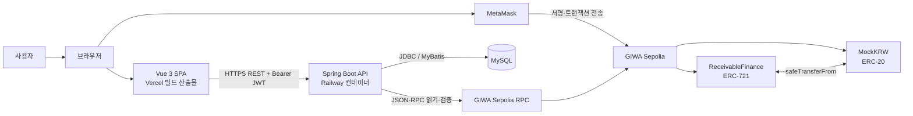
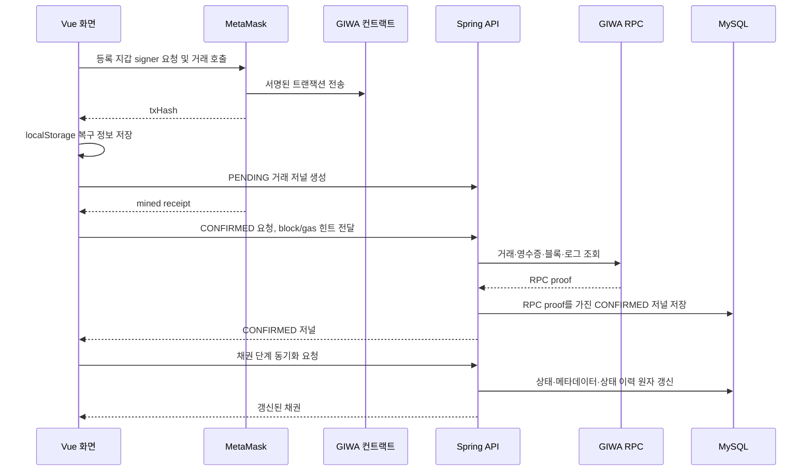
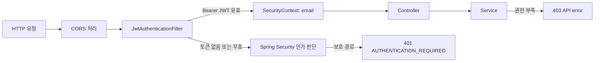
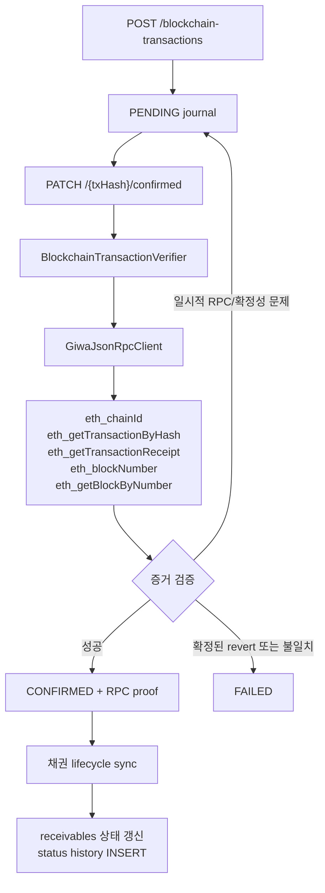
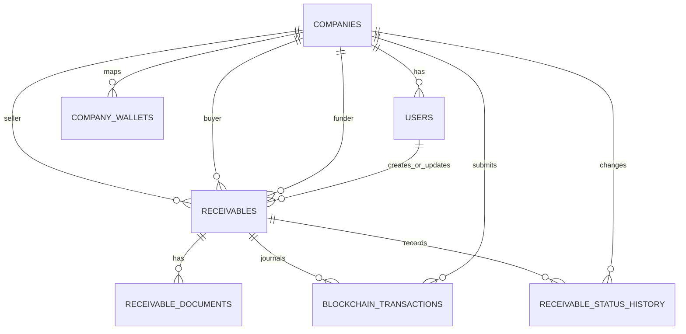
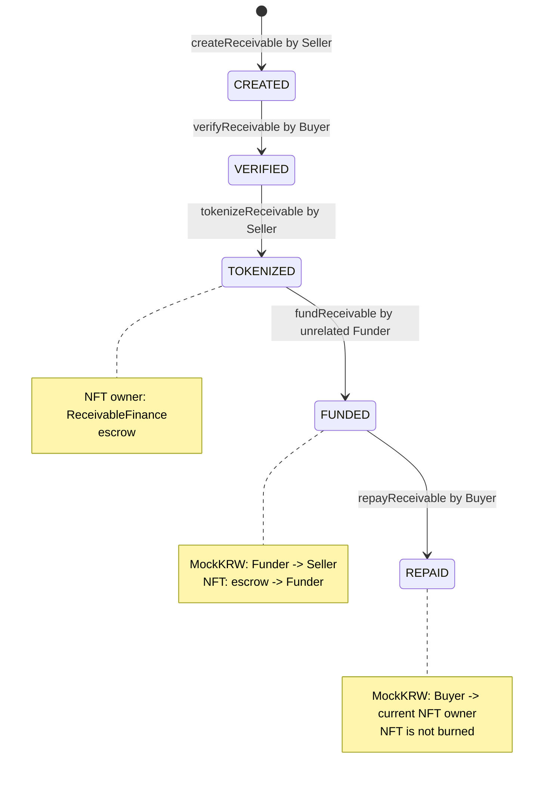
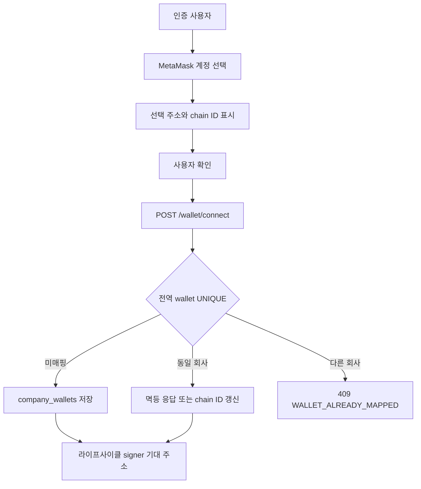
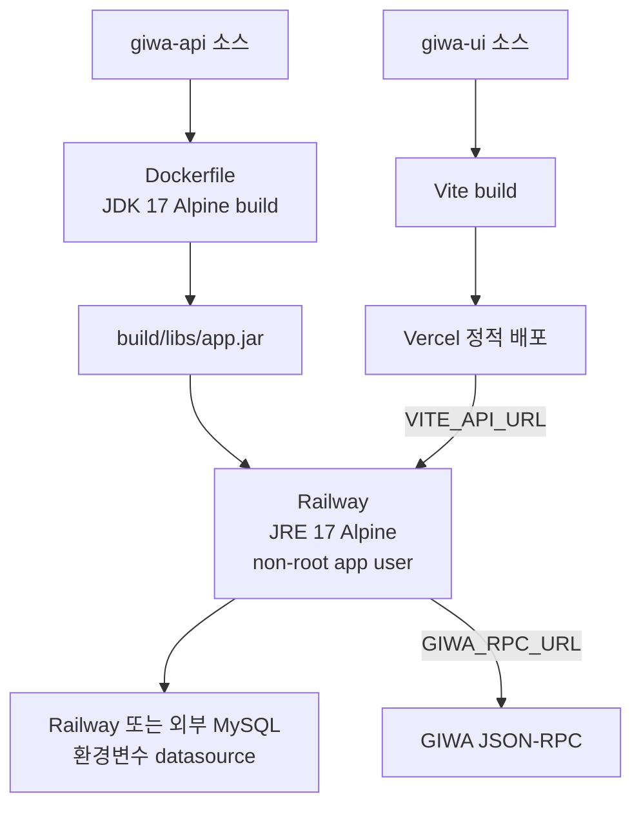

# 시스템 아키텍처

## 문서 탐색

[최종 백서](./WHITEPAPER.md) | [프로젝트 분석](./PROJECT_ANALYSIS.md) | [스마트 컨트랙트](./SMART_CONTRACT_DESIGN.md) | [백엔드](./BACKEND_DESIGN.md) | [프런트엔드](./FRONTEND_DESIGN.md) | [보안 및 기술 의사결정](./SECURITY_AND_TECHNICAL_DECISIONS.md) | [백서 초안](./WHITEPAPER_DRAFT.md)

## 1. 범위와 구성

- 시스템은 GIWA Sepolia 기반 매출채권 금융 MVP다.
- 실행 구성요소는 Vue 3 SPA, Spring Boot REST API, MySQL, MetaMask, GIWA Sepolia의 `ReceivableFinance` 및 `MockKRW` 컨트랙트다.
- 프런트엔드는 `giwa-ui`, 백엔드는 `giwa-api`, 컨트랙트와 Hardhat 도구는 `giwa-contrract` 디렉터리에 있다.
- 브라우저가 모든 상태 변경 거래에 서명하고 제출한다. 백엔드는 개인키를 저장하거나 거래를 제출하지 않는다.
- 백엔드는 DB의 업무 상태와 거래 저널을 관리하고, GIWA JSON-RPC를 통해 온체인 거래 증거를 독립 검증한다.

## 2. 전체 아키텍처와 책임 분리

| 구성요소 | 구현 | 책임 | 통신 대상 |
| --- | --- | --- | --- |
| 브라우저 SPA | Vue 3, Vite, Pinia, PrimeVue, ethers v6 | 사용자 화면, JWT 보관, REST 호출, MetaMask 제어, 거래 복구 상태 보관 | Spring API, MetaMask, GIWA RPC |
| MetaMask | EIP-1193 Browser Provider | 계정 선택, 네트워크 전환, signer 제공, Approval/컨트랙트 거래 서명·전송 | 브라우저, GIWA Sepolia |
| Spring API | Spring Boot 4.1.0, Java 17, Spring Security, JJWT | 인증, 권한, 업무 상태 전이, 거래 저널, RPC 검증, 공통 오류 응답 | SPA, MySQL, GIWA RPC |
| MySQL | MySQL 8 스키마 | 회사·사용자·지갑·채권·거래 저널·상태 이력 영속화 | Spring API |
| GIWA RPC | JSON-RPC HTTP endpoint | 체인 ID, 거래, 영수증, 최신 블록, canonical block 조회 | Spring API, 브라우저 read provider |
| ReceivableFinance | Solidity 0.8.24, OpenZeppelin ERC-721 | 온체인 채권 상태, NFT 에스크로·이전, 펀딩·상환 실행 | MetaMask signer, MockKRW |
| MockKRW | Solidity 0.8.24, OpenZeppelin ERC-20/Ownable | 테스트용 0 decimal 결제 토큰, owner mint | MetaMask signer, ReceivableFinance |

- 오프체인 DB 상태와 온체인 상태는 별도 저장소다.
- DB 상태 변경은 확인된 거래 저널과 RPC 검증 결과가 있을 때만 수행한다.
- 브라우저의 영수증 파싱은 UX와 복구에 사용한다. 백엔드 동기화 권한은 백엔드 RPC 검증 결과가 결정한다.

## 3. 프런트엔드 아키텍처

### 3.1 런타임 및 라우팅

| 항목 | 구현 |
| --- | --- |
| 프레임워크 | Vue 3 Composition API |
| 빌드 | Vite |
| 상태 | Pinia |
| UI | PrimeVue, Aura theme, PrimeIcons |
| 라우팅 | Vue Router `createWebHistory` |
| Web3 | ethers.js v6 `BrowserProvider`, `JsonRpcProvider`, `Contract` |

| 경로 | 컴포넌트 | 접근 제어 |
| --- | --- | --- |
| `/` | `/login`으로 redirect | 없음 |
| `/login` | `LoginView.vue` | 로그인 사용자는 `/dashboard`로 이동 |
| `/dashboard` | `DashboardView.vue` | JWT 필요 |
| `/receivables` | `ReceivablesView.vue` | JWT 필요 |
| `/funding` | `FundingView.vue` | JWT 필요 |
| `/repayment` | `RepaymentView.vue` | JWT 필요 |

- `App.vue`는 인증된 경로에서 `/auth/me`를 호출하고 현재 로그인 이메일만 공통 세션 바에 표시한다.
- `LoginView.vue`는 로그인과 회원가입을 하나의 화면에서 제공한다.
- `AboutView.vue`, `HomeView.vue`, 시작 템플릿 컴포넌트 및 `counter` store는 현재 라우팅된 업무 흐름에 사용되지 않는다.

### 3.2 상태와 API 계층

| 모듈 | 상태/기능 | 백엔드 통신 |
| --- | --- | --- |
| `stores/auth.js` | access token, 현재 사용자, 로그인, 회원가입, 로그아웃 | `/auth/*` |
| `stores/wallet.js` | 연결된 지갑, 선택 대기 지갑, 계정 선택/확정 | `/wallet/*`, MetaMask |
| `stores/receivable.js` | 목록, 상세, funding 기회, 라이프사이클 동기화 | `/receivables/*` |
| `services/api.js` | 공통 `fetch`, JSON body, Authorization header, `ApiError` 변환 | 모든 REST API |
| `services/blockchainTransactions.js` | 거래 저널 생성·확정·실패·목록 | `/blockchain-transactions`, `/receivables/{id}/transactions` |

- `accessToken`은 브라우저 `localStorage` 키 `accessToken`에 저장한다.
- `apiRequest`는 `VITE_API_URL`의 끝 슬래시를 제거한 뒤 상대 API path를 붙인다.
- 응답 실패는 `status`, `code`, `message`, `fieldErrors`를 포함하는 `ApiError`로 변환한다.
- 프런트엔드에는 refresh token, 토큰 갱신 API, 서버 세션 저장소가 없다. 현재 MVP에서는 구현되지 않았으며 향후 구현 예정입니다.

### 3.3 Web3 계층

| 모듈 | 구현 책임 |
| --- | --- |
| `contracts/addresses.js` | `VITE_GIWA_*`, Finance/MockKRW 주소, explorer URL 읽기 |
| `services/web3/provider.js` | MetaMask 탐지, 필수 chain ID 검증/전환, 등록 주소와 일치하는 signer 획득 |
| `services/web3/errors.js` | MetaMask 및 ethers 오류의 업무 코드 변환 |
| `services/web3/receivableContract.js` | 컨트랙트 read/write, 사전검증, Approval, 영수증 이벤트 확인, 저널 연동, 재시도/교체 거래 복구 |

- 지갑 매핑 시 `wallet_requestPermissions`를 사용해 계정 선택을 요청한 뒤, 선택 주소를 사용자 확인 후 `/wallet/connect`로 저장한다.
- 컨트랙트 쓰기 시 index 0 계정을 가정하지 않고, DB에 등록된 기대 주소를 `getSigner(expectedAddress)`로 요청한다.
- `VITE_GIWA_CHAIN_ID`, `VITE_GIWA_CHAIN_ID_HEX`, RPC URL, 컨트랙트 주소를 검증한다. zero/placeholder 주소는 배포 주소로 취급하지 않는다.
- `createReceivable`, `verifyReceivable`, `tokenizeReceivable`, `fundReceivable`, `repayReceivable` 거래는 모두 MetaMask signer를 사용한다.
- Funding과 Repayment의 ERC-20 Approval은 라이프사이클 거래와 별개이며 거래 저널에 기록하지 않는다.

### 3.4 브라우저 거래 처리

- MetaMask가 hash를 반환하면 브라우저는 먼저 회사 단위 `localStorage` 복구 레코드를 저장하고 PENDING 저널을 생성한다.
- 브라우저는 receipt의 이벤트를 검사하지만, CONFIRMED 요청 이후 백엔드가 동일 거래를 RPC에서 재검증한다.
- 새로고침·시간 초과·교체 거래 시 저장된 hash, nonce, calldata, sender, scan cursor를 사용해 제한된 블록 범위에서 복구한다.
- 온체인 성공 후 DB 동기화가 실패하면 동일 hash로 백엔드 동기화만 재시도한다. 이 경우 새 컨트랙트 거래를 제출하지 않는다.
- 거래 복구 레코드는 브라우저 저장소에만 있다. 다른 기기나 브라우저 간의 완전한 복구 동기화는 현재 MVP에서는 구현되지 않았으며 향후 구현 예정입니다.

## 4. 백엔드 아키텍처

### 4.1 모듈 구조

| 패키지 | 주요 클래스 | 책임 |
| --- | --- | --- |
| `auth` | `AuthController`, `AuthService`, `JwtService` | 가입, 로그인, JWT 생성/검증, 현재 사용자 |
| `company` | `CompanyMapper` | 회사 생성 및 사업자번호 조회 |
| `wallet` | `WalletController`, `WalletService`, `WalletMapper` | 회사-지갑 매핑과 전역 중복 처리 |
| `receivable` | `ReceivableController`, `ReceivableService`, `ReceivableMapper` | 채권 생성/조회, 권한 검사, 라이프사이클 DB 동기화 |
| `transaction` | `BlockchainTransactionService`, `BlockchainTransactionVerifier`, `GiwaJsonRpcClient` | 거래 저널, RPC proof 조회·검증·실패 처리 |
| `config` | `SecurityConfig`, `SecurityErrorHandler`, `MyBatisConfig` | Security filter chain, CORS, 오류 응답, MyBatis 설정 |
| `common/error` | `ApiException`, `ApiError`, `GlobalExceptionHandler` | 공통 API 오류 모델 및 예외 변환 |
| `health` | `HealthController` | 공개 liveness endpoint |

- 문서에서 언급하는 `document` 모듈은 `src/main/java`에 존재하지 않는다. 현재 MVP에서는 구현되지 않았으며 향후 구현 예정입니다.

### 4.2 인증과 요청 보안

- 공개 경로는 `/auth/signup`, `/auth/login`, `/health`, `/error`와 ERROR dispatcher다.
- 나머지 경로는 인증이 필요하다.
- JWT filter는 Bearer 토큰의 email을 추출하여 `UsernamePasswordAuthenticationToken` principal로 설정한다.
- 회원가입은 회사 INSERT와 사용자 INSERT를 하나의 `@Transactional` 처리로 수행한다.
- 비밀번호는 `BCryptPasswordEncoder`로 해시한다.
- JWT 기본 만료는 `jwt.expiration-ms`의 86,400,000 ms다.
- CSRF는 비활성화되어 있다. 인증은 cookie가 아닌 Authorization Bearer header를 사용한다.

### 4.3 REST API와 업무 서비스 통신

| API 그룹 | Controller → Service | 주요 DB 접근 | 외부 통신 |
| --- | --- | --- | --- |
| Auth | `AuthController` → `AuthService` | `companies`, `users` | 없음 |
| Wallet | `WalletController` → `WalletService` | `users`, `company_wallets` | 없음 |
| Receivable | `ReceivableController` → `ReceivableService` | `receivables`, `receivable_status_history`, 거래 저널 조회 | 동기화 전 `BlockchainTransactionService` 사용 |
| Transaction | `BlockchainTransactionController` → `BlockchainTransactionService` | `blockchain_transactions`, `receivables`, `company_wallets` | `BlockchainTransactionVerifier` → GIWA RPC |
| Health | `HealthController` | 없음 | 없음 |

- MyBatis Mapper는 annotation SQL을 사용한다. XML mapper 파일은 없다.
- 상태 변경 SQL은 회사 ID, 기존 상태, 필요한 이전 단계 메타데이터를 `WHERE` 조건에 포함한다.
- `READ_COMMITTED` 트랜잭션을 사용하고, 상태 전이 판정 조회는 MyBatis local cache를 우회하도록 구성되어 있다.
- 공통 오류 JSON은 `status`, `code`, `message`, `path`, `timestamp`, `fieldErrors` 필드를 가진다.

### 4.4 거래 저널과 RPC 검증

- 지원 거래 유형은 `CREATE_RECEIVABLE`, `VERIFY_RECEIVABLE`, `TOKENIZE_RECEIVABLE`, `FUND_RECEIVABLE`, `REPAY_RECEIVABLE`이다.
- 저널 생성 시 client는 채권 ID, 유형, 컨트랙트 주소, hash만 보낸다. 회사, 등록 지갑, 초기 chain ID, 함수명, 필수 역할/상태는 서버가 결정한다.
- CONFIRMED 처리 시 server는 client가 보낸 block/gas 값과 별도로 RPC proof를 획득한다.
- 검증 대상은 chain ID, transaction/receipt hash, canonical block hash, 확정 수, signer, target, native value, ABI selector와 calldata 인자, 정확히 하나의 lifecycle event다.
- TOKENIZE는 ERC-721 mint Transfer, FUND는 MockKRW Funder→Seller Transfer와 ERC-721 escrow→Funder Transfer, REPAY는 MockKRW Buyer→현재 NFT owner Transfer까지 검증한다.
- RPC 검증 결과는 chain ID, block number/hash, gas used, effective gas price, event receivable ID/token ID, `rpc_verified_at`, `verification_version`으로 기록한다.
- `verification_version`은 authoritative proof 성공/실패 저장마다 증가하며, 갱신은 compare-and-set 조건을 사용한다.
- 인덱서나 서버 주도 폴링 워커는 없다. 현재 MVP에서는 구현되지 않았으며 향후 구현 예정입니다.

## 5. 데이터베이스 아키텍처

### 5.1 논리 데이터 모델

| 테이블 | 핵심 컬럼 및 제약 |
| --- | --- |
| `companies` | `company_id` PK, `business_number CHAR(10)` UNIQUE |
| `users` | `user_id` PK, `email` UNIQUE, `password_hash`, `company_id` FK |
| `company_wallets` | `wallet_address VARCHAR(42)` UNIQUE, `company_id` FK, `chain_id` |
| `receivables` | Seller/Buyer/Funder 회사·지갑, `DECIMAL(36,0)` 금액, 상태, 온체인 ID/token ID, 계약·거래 hash |
| `blockchain_transactions` | `tx_hash` UNIQUE, 유형, 상태, RPC proof 요약, 오류, `verification_version` |
| `receivable_status_history` | 이전/현재 상태, 변경 회사·지갑, tx hash, 사유 |
| `receivable_documents` | 파일 이름, 경로, content type, SHA-256 등의 메타데이터 |

- `receivables`는 Seller와 Buyer가 달라야 하고, `face_value > 0`, `0 < funding_amount <= face_value`, `maturity_date > issue_date`여야 한다.
- `(contract_address, onchain_receivable_id)`, `create_tx_hash`, `verify_tx_hash`는 UNIQUE다.
- `blockchain_transactions.tx_hash`는 전 라이프사이클에서 전역 UNIQUE다.
- `token_id`, `onchain_receivable_id`, event ID는 MySQL `BIGINT UNSIGNED` 및 Java `Long`으로 처리된다. 임의의 전체 `uint256` 범위를 지원하지 않는다.
- `receivable_documents`는 스키마에만 존재한다. 파일 업로드·파일 저장·문서 조회 API는 현재 MVP에서는 구현되지 않았으며 향후 구현 예정입니다.

### 5.2 스키마 초기화 및 마이그레이션

| 파일 | 용도 |
| --- | --- |
| `.codex/schema.sql` | 새 MySQL DB의 전체 스키마. 시작 시 기존 테이블을 DROP한다. |
| `20260730_receivable_chain_metadata_uniques.sql` | 기존 `receivables`의 chain metadata UNIQUE 제약 추가 전 사전 검사/ALTER |
| `20260730_blockchain_transactions.sql` | 기존 DB에 저널 테이블이 없을 때 `CREATE TABLE IF NOT EXISTS` |
| `20260730_blockchain_transaction_rpc_verification.sql` | 기존 저널에 RPC proof 컬럼 4개 추가 |
| `20260730_blockchain_transaction_verification_version.sql` | 기존 저널에 CAS version 컬럼 추가 |

- `spring.sql.init.mode=never`이므로 Spring Boot가 스키마를 자동 초기화하지 않는다.
- H2 통합 테스트는 `src/test/resources/schema.sql`의 별도 스키마를 사용한다.
- 운영 마이그레이션 실행 자동화는 현재 MVP에서는 구현되지 않았으며 향후 구현 예정입니다.

## 6. 스마트 컨트랙트 및 블록체인 아키텍처

### 6.1 컨트랙트 구성

| 컨트랙트 | 상속/라이브러리 | 상태 | 외부 함수 |
| --- | --- | --- | --- |
| `MockKRW` | `ERC20`, `Ownable` | 배포자 초기 공급량 1,000,000,000, `decimals() = 0` | `mint`, ERC-20 표준 함수 |
| `ReceivableFinance` | `ERC721`, `ReentrancyGuard`, `SafeERC20` | 불변 `paymentToken`, 순번 ID, `mapping(receivableId => Receivable)` | `createReceivable`, `verifyReceivable`, `tokenizeReceivable`, `fundReceivable`, `repayReceivable`, `getReceivable` |

- `ReceivableFinance` 생성자는 MockKRW 주소를 받아 `paymentToken` immutable로 저장한다.
- 각 온체인 채권은 Seller, Buyer, Funder, 액면가, 펀딩금, 발행/만기 timestamp, `bytes32 documentHash`, NFT token ID, 상태를 저장한다.
- 온체인 상태 enum은 `CREATED`, `VERIFIED`, `TOKENIZED`, `FUNDED`, `REPAID`, `CANCELLED`다.
- `CANCELLED`는 enum에만 있으며 상태 전이 함수가 없다. 현재 MVP에서는 구현되지 않았으며 향후 구현 예정입니다.

### 6.2 온체인 상태 및 자산 이동

| 함수 | caller 및 상태 조건 | 상태/자산 결과 | 이벤트 |
| --- | --- | --- | --- |
| `createReceivable` | Buyer가 zero/self가 아니어야 함; 금액·날짜 검증 | CREATED 저장, NFT 미발행 | `ReceivableCreated` |
| `verifyReceivable` | 저장된 Buyer, CREATED | VERIFIED | `ReceivableVerified` |
| `tokenizeReceivable` | 저장된 Seller, VERIFIED | TOKENIZED, NFT를 컨트랙트로 mint | `ReceivableTokenized` |
| `fundReceivable` | Seller/Buyer가 아닌 caller, TOKENIZED | MockKRW `fundingAmount`를 Seller로 전송, NFT를 Funder로 전송, FUNDED | `ReceivableFunded` |
| `repayReceivable` | 저장된 Buyer, FUNDED | 현재 NFT owner에 MockKRW `faceValue` 전송, REPAID | `ReceivableRepaid` |

- `fundReceivable`와 `repayReceivable`은 `nonReentrant`이며 `SafeERC20.safeTransferFrom`을 사용한다.
- Funder는 `fundingAmount`, Buyer는 `faceValue`만큼 Finance 컨트랙트에 allowance를 먼저 부여해야 한다.
- 만기 timestamp는 채권 데이터와 이벤트에 포함되지만, `repayReceivable`에서 block time을 검사하지 않는다.
- 부분 펀딩, 부분 상환, 다중 Funder, 연체/디폴트, oracle 검증은 현재 MVP에서는 구현되지 않았으며 향후 구현 예정입니다.

### 6.3 블록체인 네트워크 및 배포 메타데이터

| 항목 | 구현 값 |
| --- | --- |
| 네트워크 | GIWA Sepolia |
| chain ID | `91342` |
| Solidity | `0.8.24+commit.e11b9ed9` |
| optimizer | enabled, 200 runs |
| viaIR | disabled |
| EVM version | Paris |
| MockKRW 주소 | `0x5cD8a99Dcf5Fa00fb4fD9873b41A15F9C13C9d3F` |
| ReceivableFinance 주소 | `0x0f264334f98BA0d22f7Fc6Bb901a5Fa36158a315` |

- 주소·배포 거래 hash·block number·deployer·컴파일러 설정은 `giwa-contrract/deployment/giwa-testnet.json`에 기록된다.
- Hardhat은 로컬 `solc`를 강제하며, deploy/verify 스크립트는 GIWA chain ID와 Finance의 `paymentToken()` 연결을 확인한다.
- 새 컨트랙트 배포본은 이전 배포본의 채권, NFT, MockKRW 잔액, allowance와 저장소를 공유하지 않는다.
- 컨트랙트 proxy 및 upgrade 경로는 없다. 현재 MVP에서는 구현되지 않았으며 향후 구현 예정입니다.

## 7. 지갑 아키텍처

- `company_wallets.wallet_address`는 전역 UNIQUE다.
- 동일 회사의 동일 주소 재연결은 허용되며 저장된 chain ID를 갱신한다.
- 동일 주소가 다른 회사에 매핑되어 있으면 `WALLET_ALREADY_MAPPED`를 반환하고 기존 회사 식별자는 노출하지 않는다.
- 각 lifecycle 거래는 역할별 DB 등록 주소를 기대 signer로 사용한다.
- Funder 거래는 현재 인증 회사의 primary wallet을 사용한다.
- 서버는 지갑의 소유를 메시지 서명으로 증명받지 않는다. 현재 MVP에서는 구현되지 않았으며 향후 구현 예정입니다.

## 8. 배포 아키텍처

### 8.1 프런트엔드와 백엔드 배포

- Dockerfile은 Gradle wrapper로 `bootJar`를 빌드하고 runtime image에서 `java -jar /app/app.jar`를 실행한다.
- 서버는 `0.0.0.0`에 바인딩하고, 포트는 `PORT`, 그 다음 `SERVER_PORT`, 기본 `8080` 순서로 읽는다.
- datasource는 `DB_*` 또는 Railway `MYSQLHOST`, `MYSQLPORT`, `MYSQLDATABASE`, `MYSQLUSER`, `MYSQLPASSWORD`를 읽는다.
- CORS 허용 origin은 `CORS_ALLOWED_ORIGINS`의 comma-separated exact origin 목록이다.
- 공개 `/health`는 liveness endpoint이며 MySQL 연결이나 GIWA RPC 상태를 검사하지 않는다.

### 8.2 구성 변수

| 계층 | 변수 |
| --- | --- |
| 프런트엔드 | `VITE_API_URL`, `VITE_GIWA_CHAIN_ID`, `VITE_GIWA_CHAIN_ID_HEX`, `VITE_GIWA_RPC_URL`, `VITE_GIWA_EXPLORER_URL`, `VITE_RECEIVABLE_FINANCE_ADDRESS`, `VITE_MOCK_KRW_ADDRESS` |
| 백엔드 데이터베이스 | `DB_HOST`, `DB_PORT`, `DB_NAME`, `DB_USERNAME`, `DB_PASSWORD`, Railway `MYSQL*` |
| 백엔드 보안/CORS | `JWT_SECRET`, `JWT_EXPIRATION_MS`, `CORS_ALLOWED_ORIGINS` |
| 백엔드 블록체인 | `GIWA_RPC_URL`, `GIWA_CHAIN_ID`, `GIWA_RECEIVABLE_FINANCE_ADDRESS`, `GIWA_MOCK_KRW_ADDRESS`, `GIWA_RPC_TIMEOUT_MS`, `GIWA_MIN_CONFIRMATIONS` |
| Hardhat 배포 | `GIWA_RPC_URL`, 일시적 `DEPLOYER_PRIVATE_KEY`, 선택적 `ALLOW_REDEPLOY` |

- Vite 환경변수는 빌드 시 정적으로 포함되므로 Vercel 환경변수 변경 후 재빌드가 필요하다.
- `DEPLOYER_PRIVATE_KEY`는 Hardhat 배포 시 현재 터미널 환경변수로만 읽도록 구현되어 있다.
- CI/CD 파이프라인, Infrastructure as Code, 비밀관리 시스템 설정은 저장소에 없다. 현재 MVP에서는 구현되지 않았으며 향후 구현 예정입니다.
- Railway와 Vercel의 실제 런타임 환경변수 및 배포본 상태는 저장소만으로 검증할 수 없다.

## 9. 구현되지 않은 경계와 제약

- 실결제, KYC/AML, 신용평가, 외부 기업/채권 검증, oracle은 현재 MVP에서는 구현되지 않았으며 향후 구현 예정입니다.
- 파일 업로드, 문서 저장소, 문서 다운로드, 문서 API는 현재 MVP에서는 구현되지 않았으며 향후 구현 예정입니다.
- 매출채권 수정·삭제 API, 관리자 API, 검색·페이지네이션 API는 현재 MVP에서는 구현되지 않았으며 향후 구현 예정입니다.
- 블록체인 indexer, webhook consumer, 비동기 거래 확인 worker, 알림 시스템은 현재 MVP에서는 구현되지 않았으며 향후 구현 예정입니다.
- 권한형 NFT 양도 제한, 다중 서명, 키 관리, 침해 탐지, 프로덕션 금융 통제는 현재 MVP에서는 구현되지 않았으며 향후 구현 예정입니다.
