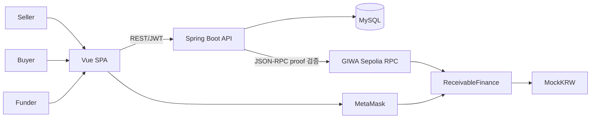
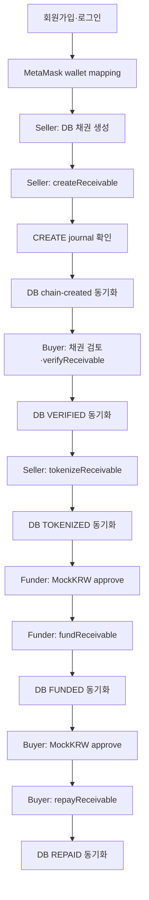
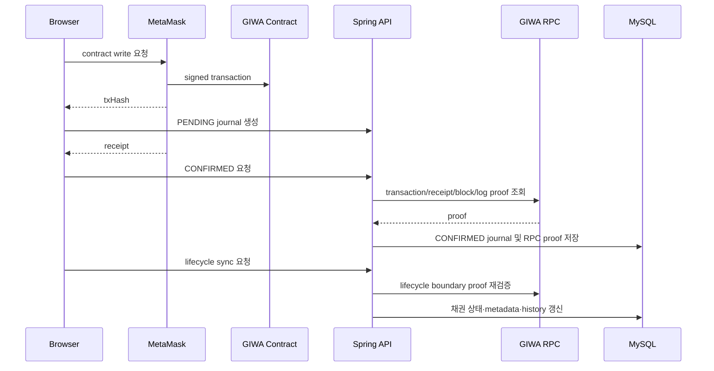

# GIWA Receivable Financing MVP 백서 초안

## 문서 탐색

[최종 백서](./WHITEPAPER.md) | [프로젝트 분석](./PROJECT_ANALYSIS.md) | [시스템 아키텍처](./SYSTEM_ARCHITECTURE.md) | [스마트 컨트랙트](./SMART_CONTRACT_DESIGN.md) | [백엔드](./BACKEND_DESIGN.md) | [프런트엔드](./FRONTEND_DESIGN.md) | [보안 및 기술 의사결정](./SECURITY_AND_TECHNICAL_DECISIONS.md)

## 1. Project Overview

- 프로젝트는 GIWA Sepolia에서 매출채권의 생성, Buyer 검증, ERC-721 토큰화, 제3자 펀딩, Buyer 상환을 연결하는 MVP다.
- Seller는 오프체인 채권 정보를 DB에 등록하고 MetaMask로 `ReceivableFinance.createReceivable`을 호출한다.
- Buyer는 등록된 지갑으로 채권을 검증한다.
- Seller는 Buyer 검증 이후 채권을 ERC-721 NFT로 토큰화한다.
- Funder는 MockKRW를 Seller에게 지급하고 NFT를 받는다.
- Buyer는 `faceValue`를 상환 시점의 NFT 소유자에게 지급한다.
- 구성은 Vue 3 SPA, Spring Boot REST API, MySQL, GIWA Sepolia, Solidity 컨트랙트, MetaMask다.
- 실결제, KYC/AML, 신용평가, 유동성 풀을 제공하지 않는 MVP다.

| 영역             | 구현                                                       |
| ---------------- | ---------------------------------------------------------- |
| Frontend         | Vue 3, Vite, Pinia, ethers.js v6, PrimeVue                 |
| Backend          | Spring Boot 4.1.0, Java 17, MyBatis, Spring Security, JJWT |
| Database         | MySQL 8 스키마, H2 통합 테스트 스키마                      |
| Blockchain       | GIWA Sepolia, Solidity 0.8.24, OpenZeppelin 5.4.0          |
| Token            | MockKRW ERC-20, 0 decimals                                 |
| Receivable asset | ERC-721 `GIWA Receivable` (`GRCV`)                         |

## 2. Problem Statement

- 이 MVP가 모델링하는 업무 흐름은 Seller, Buyer, Funder가 참여하는 매출채권 금융 단계다.
- 매출채권의 당사자, 금액, 날짜, 문서 해시, 검증, 자금 공급, 상환을 서로 다른 계층에서 일관되게 연결해야 한다.
- 온체인 거래 hash만 DB에 저장하면 해당 hash가 기대한 당사자·함수 호출·이벤트·정산 이동에 대응하는지 보장할 수 없다.
- NFT가 펀딩 이후 양도될 수 있는 경우, 상환 수취인은 원래 Funder가 아닌 현재 NFT 소유자로 결정되어야 한다.
- 브라우저 트랜잭션은 receipt 대기, 새로고침, MetaMask replacement, backend 동기화 실패를 고려해야 한다.

| 문제 범위               | MVP의 처리 방식                                              |
| ----------------------- | ------------------------------------------------------------ |
| 채권 당사자와 지갑 연결 | 회사-지갑 매핑과 Seller/Buyer/Funder 역할 검사               |
| 순차적 거래 단계        | `CREATED → VERIFIED → TOKENIZED → FUNDED → REPAID` 상태 머신 |
| 온체인 거래의 DB 동기화 | PENDING/CONFIRMED/FAILED 저널과 server-side RPC proof 검증   |
| 펀딩의 NFT 이전         | Finance 컨트랙트 에스크로에서 Funder로 ERC-721 이전          |
| NFT 양도 이후 상환      | `ownerOf(tokenId)`로 현재 수취인 조회                        |
| 브라우저 중단/교체 거래 | localStorage 기반 hash·intent·replacement recovery           |

- 실제 채권의 법적 유효성, 외부 문서 검증, 신용 위험, 현금 결제, 규제 준수는 현재 MVP에서는 구현되지 않았으며 향후 구현 예정입니다.

## 3. Proposed Solution

- 오프체인 업무 상태는 MySQL에 저장하고, 온체인 경제적 상태와 NFT 소유권은 `ReceivableFinance`에 저장한다.
- 모든 컨트랙트 상태 변경은 MetaMask signer가 수행한다.
- 백엔드는 private key를 보관하거나 컨트랙트 거래를 제출하지 않는다.
- 백엔드는 lifecycle DB 상태를 변경하기 전에 GIWA RPC에서 transaction, receipt, block, log를 조회하고 기대 proof를 검증한다.
- Frontend는 MetaMask receipt를 즉시 확인하고 backend 거래 저널을 갱신하며, backend lifecycle sync가 실패한 경우 동일 거래 hash로 동기화만 재시도한다.

- 채권 DB 상태와 온체인 상태의 동기화는 API 요청을 통해 수행되며, 서버 주도 indexer가 이를 자동 처리하지 않는다.
- 블록체인 indexer, webhook, event subscription, background reconciliation worker는 현재 MVP에서는 구현되지 않았으며 향후 구현 예정입니다.

## 4. Architecture

### 4.1 구성요소와 통신

| 구성요소          | 책임                                                                    | 통신                                       |
| ----------------- | ----------------------------------------------------------------------- | ------------------------------------------ |
| Vue SPA           | UI, API 호출, MetaMask 계정/네트워크/signer 선택, receipt/recovery 처리 | REST API, MetaMask, GIWA RPC read provider |
| MetaMask          | 사용자 계정 선택, EVM transaction 서명·전송                             | 브라우저, GIWA Sepolia                     |
| Spring Boot API   | 인증, wallet mapping, 채권 DB 상태, 저널, RPC proof 검증                | SPA, MySQL, GIWA RPC                       |
| MySQL             | 사용자·회사·wallet·채권·저널·상태 이력                                  | Spring Boot API                            |
| GIWA RPC          | chain/transaction/receipt/block 조회                                    | Backend verifier, frontend read provider   |
| ReceivableFinance | 채권 상태, ERC-721 NFT, 펀딩/상환 정산                                  | MetaMask signer, MockKRW                   |
| MockKRW           | 테스트 결제 토큰과 allowance 기반 전송                                  | MetaMask signer, ReceivableFinance         |

### 4.2 신뢰 경계

| 경계                | 처리                                                                |
| ------------------- | ------------------------------------------------------------------- |
| Browser → API       | Bearer JWT, backend에서 사용자·회사·역할 재조회                     |
| Browser → MetaMask  | 등록 기대 wallet address를 대상으로 signer 요청, chain ID 검사      |
| API → MySQL         | MyBatis annotation SQL, FK/UNIQUE/CHECK/조건부 UPDATE               |
| API → GIWA RPC      | transaction/receipt/block proof 조회와 lifecycle별 검증             |
| MetaMask → Contract | Solidity access control, state machine, `SafeERC20`, `nonReentrant` |

- 프런트엔드의 receipt 검사는 UX와 recovery를 위한 것이며 backend RPC proof 검증을 대체하지 않는다.
- backend가 DB lifecycle write를 수행하는 기준은 CONFIRMED 저널과 검증 proof다.

## 5. Business Flow

### 5.1 Lifecycle

### 5.2 역할과 자산 이동

| 단계       | 허용 actor                      | DB 상태   | 온체인 상태 | 자산 이동                                  |
| ---------- | ------------------------------- | --------- | ----------- | ------------------------------------------ |
| 채권 등록  | Seller 회사 사용자              | CREATED   | 없음        | 없음                                       |
| 체인 생성  | Seller 등록 wallet              | CREATED   | CREATED     | 없음                                       |
| Buyer 검증 | Buyer 등록 wallet               | VERIFIED  | VERIFIED    | 없음                                       |
| 토큰화     | Seller 등록 wallet              | TOKENIZED | TOKENIZED   | NFT: Finance 컨트랙트 에스크로 mint        |
| 펀딩       | Seller/Buyer 이외 Funder wallet | FUNDED    | FUNDED      | MockKRW: Funder→Seller, NFT: escrow→Funder |
| 상환       | Buyer 등록 wallet               | REPAID    | REPAID      | MockKRW: Buyer→현재 NFT owner              |

- Buyer 검토 checkbox는 frontend local state이며 별도 Web2 승인 레코드로 저장하지 않는다.
- Buyer의 `verifyReceivable` 온체인 transaction이 컨트랙트 상태의 검증 행위다.
- `funder`는 최초 펀딩 wallet로 저장되지만, NFT가 양도되면 상환 수취인은 현재 owner가 된다.
- 부분 펀딩, 다중 Funder, 부분 상환, 연체료, 디폴트, 취소는 현재 MVP에서는 구현되지 않았으며 향후 구현 예정입니다.

### 5.3 거래 저널 및 동기화

- 지원 저널 유형은 CREATE, VERIFY, TOKENIZE, FUND, REPAY다.
- 동일 입력의 저널 생성과 동일 상태 전이 재시도는 멱등적으로 처리한다.
- 같은 tx hash의 다른 metadata, 다른 lifecycle metadata는 conflict로 처리한다.
- client가 전달하는 block/gas 값은 확정 저장값이 아니며 backend RPC 값이 저장된다.

## 6. Smart Contract

### 6.1 Contracts

| 컨트랙트            | 상속/라이브러리                          | 역할                         |
| ------------------- | ---------------------------------------- | ---------------------------- |
| `ReceivableFinance` | `ERC721`, `ReentrancyGuard`, `SafeERC20` | 채권 상태, NFT, 펀딩, 상환   |
| `MockKRW`           | `ERC20`, `Ownable`                       | 테스트 정산 토큰, owner mint |

### 6.2 `ReceivableFinance` 상태와 데이터

| 저장 항목                           | 내용                                                                     |
| ----------------------------------- | ------------------------------------------------------------------------ |
| `paymentToken`                      | constructor에서 설정한 immutable ERC-20 주소                             |
| `_nextReceivableId`, `_nextTokenId` | 순차 채권/NFT ID counter                                                 |
| `_receivables`                      | Seller, Buyer, Funder, 금액, 날짜, document hash, token ID, 상태 mapping |
| ERC-721 storage                     | OpenZeppelin이 owner, balance, approval, operator approval을 관리        |

| 상태      | 전이 함수            | NFT 소유                |
| --------- | -------------------- | ----------------------- |
| CREATED   | `createReceivable`   | 없음                    |
| VERIFIED  | `verifyReceivable`   | 없음                    |
| TOKENIZED | `tokenizeReceivable` | Finance 컨트랙트        |
| FUNDED    | `fundReceivable`     | Funder 또는 이후 양수인 |
| REPAID    | `repayReceivable`    | 상환 시점 owner         |

- `CANCELLED`는 enum에만 존재하고 전이 함수는 없다. 현재 MVP에서는 구현되지 않았으며 향후 구현 예정입니다.

### 6.3 Lifecycle 함수

| 함수                 | caller/상태                                                | 결과                                                                                             |
| -------------------- | ---------------------------------------------------------- | ------------------------------------------------------------------------------------------------ |
| `createReceivable`   | 모든 caller; Buyer nonzero/self 금지, 양수 금액, 날짜 순서 | caller를 Seller로 기록하고 CREATED 생성, `ReceivableCreated` emit                                |
| `verifyReceivable`   | 저장된 Buyer, CREATED                                      | VERIFIED, `ReceivableVerified` emit                                                              |
| `tokenizeReceivable` | 저장된 Seller, VERIFIED                                    | token ID 생성, Finance에 NFT mint, TOKENIZED, `ReceivableTokenized` emit                         |
| `fundReceivable`     | Seller/Buyer 이외 주소, TOKENIZED                          | MockKRW funding amount를 Seller로 전송, NFT를 Funder로 transfer, FUNDED, `ReceivableFunded` emit |
| `repayReceivable`    | 저장된 Buyer, FUNDED                                       | 현재 NFT owner에 face value 전송, REPAID, `ReceivableRepaid` emit                                |
| `getReceivable`      | 모든 caller                                                | 구조체 반환; 없는 ID는 revert                                                                    |

- Funder는 `fundingAmount`, Buyer는 `faceValue`만큼 Finance에 MockKRW allowance를 먼저 부여해야 한다.
- `MockKRW.decimals()`는 0이고, 1 base unit은 MVP의 정수 KRW 1단위다.
- NFT metadata URI, document onchain storage, permissioned transfer, NFT burn은 현재 MVP에서는 구현되지 않았으며 향후 구현 예정입니다.

## 7. Backend

### 7.1 모듈

| 패키지         | 책임                                                     |
| -------------- | -------------------------------------------------------- |
| `auth`         | 회원가입, 로그인, JWT 생성/파싱, 현재 사용자             |
| `company`      | 회사 INSERT 및 사업자번호 조회                           |
| `wallet`       | 회사-지갑 매핑과 주소 중복 처리                          |
| `receivable`   | 채권 생성/조회와 lifecycle DB 동기화                     |
| `transaction`  | 거래 저널, JSON-RPC client, proof verifier, failure 기록 |
| `config`       | Spring Security, CORS, MyBatis 설정                      |
| `common.error` | API 오류 모델과 예외 처리                                |
| `health`       | `GET /health`                                            |

### 7.2 인증과 데이터 접근

- 회원가입은 새 company와 user를 하나의 `@Transactional` 처리에서 생성한다.
- password는 BCrypt hash로 저장한다.
- JWT는 HMAC으로 서명되며 subject, issued-at, expiration을 생성한다. subject는 email이다.
- Spring Security는 `/auth/signup`, `/auth/login`, `/health`를 공개하고 나머지 API는 인증을 요구한다.
- Mapper는 annotation SQL을 사용하며 underscore-to-camel-case 매핑이 활성화되어 있다.
- lifecycle UPDATE는 actor company, 현재 status, 선행 metadata를 `WHERE` 조건에 포함한다.

### 7.3 RPC 검증

| lifecycle | backend 검증                                                                          |
| --------- | ------------------------------------------------------------------------------------- |
| CREATE    | Seller/Buyer/금액/날짜/document hash, create calldata, `ReceivableCreated`            |
| VERIFY    | Buyer, onchain receivable ID, verify calldata, `ReceivableVerified`                   |
| TOKENIZE  | Seller, onchain ID, tokenize calldata, `ReceivableTokenized`, NFT mint Transfer       |
| FUND      | Funder, token ID, Seller, funding amount, fund calldata, event, MockKRW/NFT Transfers |
| REPAY     | Buyer, token ID, repay calldata, event recipient, MockKRW Buyer→recipient Transfer    |

- verifier는 RPC chain ID, signer, target, native value=0, receipt 성공, canonical block, confirmation depth, event 수를 검사한다.
- proof 저장에는 block hash/number, gas, event ID/token ID, RPC 검증 시각, verification version이 포함된다.
- `/health`는 liveness endpoint이며 MySQL 또는 RPC readiness를 검사하지 않는다.
- document processing module, indexer, scheduled reconciliation, queue worker는 현재 MVP에서는 구현되지 않았으며 향후 구현 예정입니다.

## 8. Frontend

### 8.1 구조

| 영역             | 구현                                                                |
| ---------------- | ------------------------------------------------------------------- |
| Routing          | Login, Dashboard, Receivables, Funding, Repayment; 인증 route guard |
| State            | Pinia `auth`, `wallet`, `receivable` stores                         |
| API              | `services/api.js`의 공통 fetch 및 `ApiError`                        |
| Web3 provider    | MetaMask 탐지, GIWA chain 전환, expected wallet signer 선택         |
| Contract service | ABI 기반 read/write, readiness, receipt 검사, journal/recovery 처리 |

- `App.vue`는 인증 경로에서 `/auth/me`를 load하고 email을 session bar에 표시한다.
- API base URL은 `VITE_API_URL`을 사용하며 끝 슬래시를 제거해 API path와 결합한다.
- auth token은 localStorage `accessToken`에 저장한다.
- wallet 및 채권 transaction recovery payload는 브라우저 localStorage에 저장한다.

### 8.2 거래 UI

| 화면        | 구현된 흐름                                                                                             |
| ----------- | ------------------------------------------------------------------------------------------------------- |
| Dashboard   | MetaMask account permissions, pending wallet 확인, `/wallet/connect`, logout                            |
| Receivables | 채권 등록, Seller create, Buyer terms review/verify, Seller tokenize, tokenization journal gate         |
| Funding     | funding opportunities, MockKRW readiness, exact approval, separate fund action, DB sync retry           |
| Repayment   | Buyer FUNDED obligations, current owner readiness, exact approval, separate repay action, DB sync retry |

- frontend는 contract write 전에 등록 wallet, GIWA chain, onchain terms, contract configuration을 확인한다.
- tokenization은 server journal에서 CONFIRMED/PENDING 후보를 먼저 확인한다.
- onchain success 후 backend sync 실패 시 retry는 contract call을 다시 하지 않고 backend sync만 수행한다.
- browser localStorage의 recovery record는 다른 기기와 동기화되지 않는다.
- native mobile client, SSR, document upload UI, administrator UI는 현재 MVP에서는 구현되지 않았으며 향후 구현 예정입니다.

## 9. Security

### 9.1 Smart Contract Controls

| 통제           | 구현                                                        |
| -------------- | ----------------------------------------------------------- |
| 역할 검사      | 저장된 Seller/Buyer address 비교, Seller/Buyer funding 금지 |
| 상태 검사      | lifecycle별 exact enum 상태 검사                            |
| 입력 검사      | payment token, Buyer, 금액, 날짜, 존재 ID 검사              |
| reentrancy     | FUND/REPAY에 `nonReentrant`                                 |
| token transfer | `SafeERC20.safeTransferFrom`                                |
| NFT 수신       | FUND의 `_safeTransfer` receiver 검사                        |
| 실패 처리      | custom errors 및 EVM atomic rollback                        |

### 9.2 API 및 DB Controls

| 통제      | 구현                                                          |
| --------- | ------------------------------------------------------------- |
| 인증      | stateless JWT, BCrypt password hash                           |
| 오류 분리 | 401 authentication, 403 access denied, 409 conflict           |
| wallet    | 전역 UNIQUE, 회사 mapping, conflict에서 다른 회사 정보 비노출 |
| journal   | 전역 tx hash UNIQUE, 소유 회사 확인, CAS verification version |
| lifecycle | 조건부 UPDATE, 상태 이력, confirmed proof 요구                |
| proof     | RPC transaction/receipt/block/calldata/event/transfer 검증    |

### 9.3 제한

- wallet connect API는 backend message signature challenge로 wallet control을 증명하지 않는다. 현재 MVP에서는 구현되지 않았으며 향후 구현 예정입니다.
- JWT는 browser localStorage에 보관되며 refresh token, revocation, MFA가 없다. 현재 MVP에서는 구현되지 않았으며 향후 구현 예정입니다.
- CSP, WAF, rate limit, SIEM, central audit logging, secret manager integration은 현재 MVP에서는 구현되지 않았으며 향후 구현 예정입니다.
- MockKRW owner는 cap 없이 demo token을 mint할 수 있다.
- NFT는 FUNDED 이후 표준 ERC-721 transfer가 가능하며, 상환 수취인은 original Funder와 달라질 수 있다.

## 10. Technical Decisions

### 10.1 ADR 기반 결정

| 결정                       | 문서에 기록된 이유                             | 구현                                                    |
| -------------------------- | ---------------------------------------------- | ------------------------------------------------------- |
| MetaMask write transaction | private key를 저장하지 않음                    | 모든 write에 expected registered signer 사용            |
| Company-wallet mapping     | 인증은 Web2, blockchain은 ownership 검증       | JWT user의 company와 wallet table을 연결                |
| Finance NFT escrow         | Seller approval 거래 제거                      | NFT를 Finance에 mint 후 funding 시 transfer             |
| Single Funder              | MVP 단순화                                     | `Receivable.funder` 단일 address와 단일 funding 전이    |
| Backend metadata           | blockchain을 source of truth로 유지            | backend는 proof/journal을 저장하고 거래에 서명하지 않음 |
| MockKRW 0 decimals         | DB/UI/contract 간 18 decimal scaling 오류 방지 | `DECIMAL(36,0)` 및 `decimals()=0`                       |

### 10.2 Stack 및 배포 선택

| 기술         | 저장소에서 확인되는 구현                                         | 선택 사유 기록 여부                  |
| ------------ | ---------------------------------------------------------------- | ------------------------------------ |
| GIWA Sepolia | chain ID 91342, Hardhat deploy/verify, frontend/backend RPC 설정 | GIWA Hackathon target network로 기록 |
| Spring Boot  | Java 17 REST API, Spring Security, MyBatis                       | 상세 비교 사유는 저장소에 없음       |
| Vue/Vite     | Vue 3 SPA, Pinia, ethers.js                                      | 상세 비교 사유는 저장소에 없음       |
| MySQL        | 회사/사용자/채권/저널 관계 데이터 및 제약                        | 상세 비교 사유는 저장소에 없음       |
| Railway      | Docker 기반 Java API runtime, MySQL 환경변수 지원                | backend 배포 대상으로 기록           |
| Vercel       | Vite SPA build deployment, API base URL 설정                     | frontend 배포 대상으로 기록          |

- 다른 EVM network, backend/frontend framework, DB, hosting provider와의 비용·성능·운영 비교는 저장소에 기록되어 있지 않다.

## 11. MVP Scope

### 11.1 구현 범위

- 일반 이메일/비밀번호 로그인과 회사 생성
- 회사-지갑 매핑
- 매출채권 생성·목록·상세 조회
- Buyer 검증
- ERC-721 토큰화와 Finance 에스크로
- 단일 제3자 Funder의 MockKRW 펀딩
- Buyer의 full face value 상환
- 거래 저널, RPC proof 검증, retry/recovery UI
- Hardhat lifecycle/rollback 테스트와 Spring H2 통합 테스트

### 11.2 제외 범위

- 실결제, KYC/AML, 신용평가, liquidity pool, multiple funders는 현재 MVP에서는 구현되지 않았으며 향후 구현 예정입니다.
- partial funding, partial repayment, default, late payment penalty, cancellation after funding은 현재 MVP에서는 구현되지 않았으며 향후 구현 예정입니다.
- oracle-based document validation, document upload/storage, document duplicate prevention은 현재 MVP에서는 구현되지 않았으며 향후 구현 예정입니다.
- permissioned NFT transfer, upgradeable contract, production security control은 현재 MVP에서는 구현되지 않았으며 향후 구현 예정입니다.
- 매출채권 수정·삭제 API, 관리자 기능, blockchain indexer는 현재 MVP에서는 구현되지 않았으며 향후 구현 예정입니다.

## 12. Roadmap

| 우선순위     | 항목                                                                                         | 현재 상태                                              |
| ------------ | -------------------------------------------------------------------------------------------- | ------------------------------------------------------ |
| Deployment   | Railway MySQL references, JWT secret, CORS origin, fresh schema                              | 현재 MVP에서는 구현되지 않았으며 향후 구현 예정입니다. |
| Deployment   | Railway/Vercel runtime contract addresses를 replacement pair로 갱신하고 fresh lifecycle 실행 | 현재 MVP에서는 구현되지 않았으며 향후 구현 예정입니다. |
| Verification | current NFT owner의 full face value 수령 확인                                                | 현재 MVP에서는 구현되지 않았으며 향후 구현 예정입니다. |
| Concurrency  | 채권별 server-side intent lease                                                              | 현재 MVP에서는 구현되지 않았으며 향후 구현 예정입니다. |
| Operations   | blockchain indexer/reconciliation worker                                                     | 현재 MVP에서는 구현되지 않았으며 향후 구현 예정입니다. |
| Toolchain    | Hardhat 2/solc development-only audit advisory 해소                                          | 현재 MVP에서는 구현되지 않았으며 향후 구현 예정입니다. |
| Product      | 문서 처리, 실결제, KYC/AML, credit scoring                                                   | 현재 MVP에서는 구현되지 않았으며 향후 구현 예정입니다. |

- 현재 저장소의 `.env` 기본값과 `application.yml` fallback은 replacement MockKRW/ReceivableFinance 주소를 사용한다.
- 실제 Railway/Vercel runtime variable 적용과 외부 배포 상태는 저장소만으로 새로 검증하지 않았다.

## 13. Expected Impact

- 구현된 MVP는 한 매출채권의 Seller, Buyer, Funder 역할과 상태 전이를 동일한 workflow로 검증할 수 있다.
- 온체인 NFT ownership과 MockKRW Transfer를 backend RPC proof로 DB lifecycle write에 결합한다.
- 펀딩 후 NFT 양도 시 상환 수취인을 현재 NFT owner로 계산하는 동작을 컨트랙트와 테스트에 포함한다.
- MetaMask transaction hash, PENDING/CONFIRMED/FAILED 저널, browser recovery를 통해 브라우저 reload와 backend sync 실패를 별도 처리한다.
- 이 구현은 실제 금융상품의 적법성, 신용위험, 자금보관, 규제준수, 운영 통제를 보장하지 않는다.
- production financial service 운영에 필요한 KYC/AML, 실결제, 보안 운영, 감사·모니터링, 분쟁 처리 기능은 현재 MVP에서는 구현되지 않았으며 향후 구현 예정입니다.
